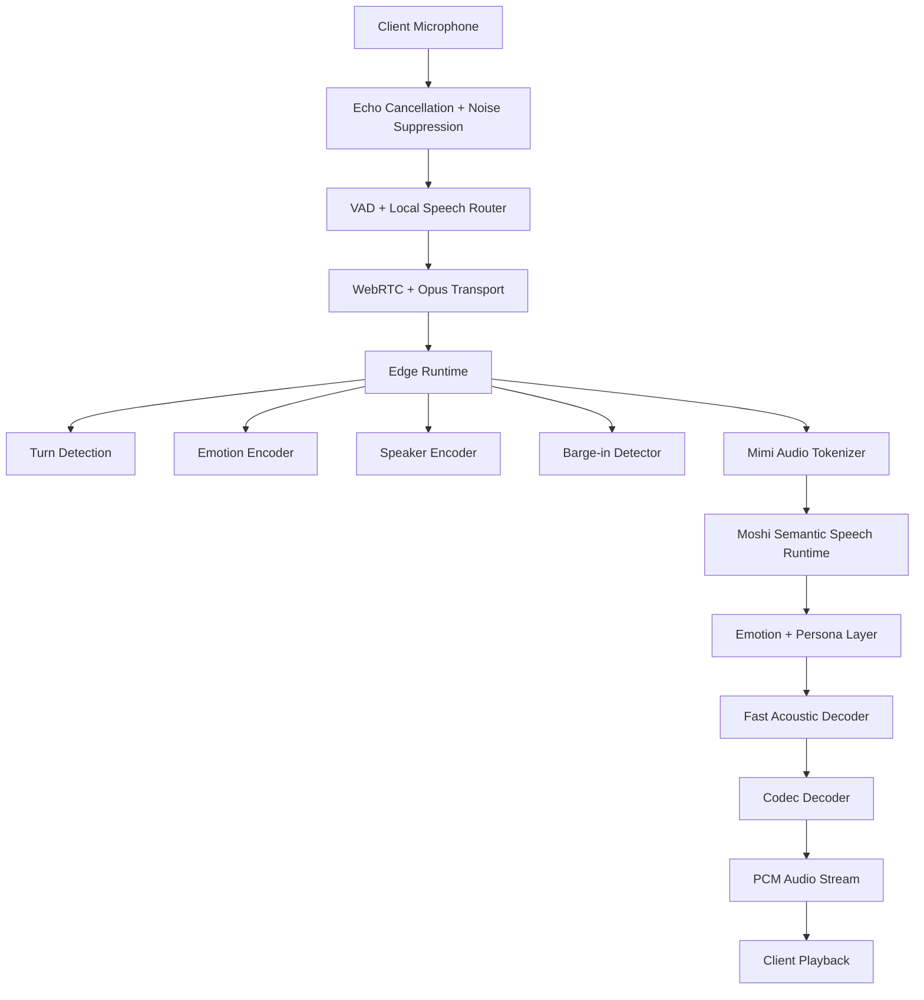

# Implementation Plan

## Overview

This plan builds a `docs/` folder that serves as AI training context for the SoulYatri Voice project. Task 1 scaffolds the folder structure and conventions, tasks 2.x author code documentation grounded in `server/**`, tasks 3.x author curated training data derived from those code docs, task 4 validates the JSONL artifacts, and task 5 commits and pushes the result to a new branch. Each task builds on the previous ones so there is no orphaned content.

## Tasks

- [ ] 1. Scaffold the docs folder structure
  - Create `docs/` with `code/` and `training/` subdirectories
  - Create `docs/README.md` describing purpose, structure, and how to consume the folder as AI training context, including a provenance note that content derives from `server/**`
  - Create `docs/FORMATS.md` documenting Markdown/JSONL conventions and the canonical JSONL schemas (Q&A and worked-example) with field tables and an example record
  - _Requirements: 1.1, 1.2, 1.3, 4.1, 4.2_

- [ ] 2. Author code documentation grounded in the source
- [ ] 2.1 Write the architecture overview
  - Create `docs/code/architecture.md` covering the Phase 1 pipeline (Audio → WebRTC → VAD → STT → LLM → TTS → Audio) and Phase 2 `VoiceAgent` orchestration (turn state machine, filler routing actions, parallel emotion+speaker extraction, barge-in)
  - Include the component-to-technology mapping (Silero VAD, faster-whisper, Ollama Qwen3, edge-tts)
  - Ensure names/behavior match `server/main.py` and `server/agent.py`
  - _Requirements: 2.1, 2.5, 2.6, 6.4_
- [ ] 2.2 Write the module reference
  - Create `docs/code/module-reference.md` covering every `server/pipeline/*` module (vad, stt, llm, tts, session, turn_state, filler, features, emotion, speaker, barge_in) and `server/utils/*` module (audio, metrics, logging_config)
  - Document key public classes/dataclasses and methods using exact names from source; reference file paths instead of pasting large code blocks
  - _Requirements: 2.2, 2.5, 2.6, 6.4_
- [ ] 2.3 Write the API/protocol reference
  - Create `docs/code/api-protocol.md` documenting `GET /health`, `GET /metrics`, `GET /api/token`, and the `WS /ws/audio/{session_id}` protocol (binary PCM frame rates, JSON control messages `config`/`end`, and server events `transcript`/`audio_meta`/`turn_metadata`)
  - Match the exact behavior in `server/main.py`
  - _Requirements: 2.3, 2.5, 6.4_
- [ ] 2.4 Write the configuration reference
  - Create `docs/code/configuration.md` documenting each settings group in `server/config.py` with its env-var prefix (root `SERVER_`/`LOG_`, `LIVEKIT_`, `OLLAMA_`, `WHISPER_`, `TTS_`, `SESSION_`, `EMOTION_`, `SPEAKER_`, `FILLER_`, `BARGE_IN_`), cross-referenced with `.env.example`
  - _Requirements: 2.4, 2.5, 6.4_
- [ ] 2.5 Write the code docs index with provenance
  - Create `docs/code/index.md` listing each code document and the source files it derives from
  - _Requirements: 1.4, 6.1_

- [ ] 3. Author curated training data
- [ ] 3.1 Create the Q&A dataset
  - Create `docs/training/qa.jsonl` with 20+ records conforming to the Q&A schema, spanning setup, architecture, configuration, protocol, and modules
  - Set the `source` field of each record to the doc section/file it is grounded in, and keep every `answer` consistent with `docs/code/*`
  - Create `docs/training/qa.md` as a human-readable mirror grouped by topic
  - _Requirements: 3.1, 3.2, 3.3, 3.4, 6.2_
- [ ] 3.2 Create worked examples
  - Create `docs/training/examples.jsonl` with at least 3 records conforming to the worked-example schema (e.g., quick-start sequence, generating a LiveKit token via `/api/token`, the WebSocket audio handshake)
  - _Requirements: 3.5_
- [ ] 3.3 Write the training index
  - Create `docs/training/index.md` listing the training files and pointing to the schema in `docs/FORMATS.md`
  - _Requirements: 1.4_

- [ ] 4. Validate the data artifacts
  - Write a small validator that reads each `.jsonl` file line by line, asserts each line parses as a standalone JSON object, checks required schema fields are present and non-empty, and verifies `id` uniqueness within each file
  - Run the validator and fix any malformed lines or duplicate IDs
  - _Requirements: 4.3, 4.4, 6.3_

- [ ] 5. Commit and push to a new branch
  - Create and switch to a new branch `docs/ai-training-context`
  - Stage only `docs/**` and `.kiro/specs/**` explicitly (no `git add .`); verify the staged file list excludes `.env`, credentials, and any files outside scope
  - Commit with a descriptive message and push with upstream tracking to `origin`
  - Report the branch name and remote URL so a pull request can be opened
  - _Requirements: 5.1, 5.2, 5.3, 5.4, 5.5_

## Notes

- Task 1 establishes the folder structure and JSONL conventions that every later task relies on.
- Tasks 2.x author the code documentation that grounds the curated training data in tasks 3.x.
- Task 4 validates the JSONL artifacts produced in tasks 3.x before they are shared.
- Task 5 is the final integration step that commits and pushes the completed docs folder.
- Each task references specific requirements for traceability.

## Task Dependency Graph

```json
{
  "waves": [
    { "id": 0, "tasks": ["1"] },
    { "id": 1, "tasks": ["2.1", "2.2", "2.3", "2.4", "2.5"] },
    { "id": 2, "tasks": ["3.1", "3.2", "3.3"] },
    { "id": 3, "tasks": ["4"] },
    { "id": 4, "tasks": ["5"] }
  ]
}
```


# SOULYATRI — Canonical Agent-Executable Master Implementation Guide

**Status:** Final master execution guide for AI agents  
**Output type:** Single comprehensive Markdown file  
**Authority rule:** The two Soulyatri markdown files are canonical. The supplementary PDFs are reference addenda only. If any addendum appears to conflict with the canonical markdown architecture, the canonical markdown wins.  
**Primary product identity:** open-source, speech-native, low-latency, full-duplex, emotional, Hindi + English + Hinglish conversational voice AI. [Source](https://www.genspark.ai/api/files/s/UgdCsYj6) [Source](https://www.genspark.ai/api/files/s/IQ1xQYRi)

---

## 1. Source hierarchy and non-negotiable rules

### 1.1 Canonical source order
1. **Primary canonical architecture:** `Soulyatri_Final_Speech_Native_Implementation_Guide.md`  
2. **Primary canonical execution expansion:** `soulyatri_final_speech_native_implementation_guide_expanded.md`  
3. **Reference addenda only:** all uploaded PDFs, including the build bibles, 60-day plan, kill-list plan, and research summary. [Source](https://www.genspark.ai/api/files/s/UgdCsYj6) [Source](https://www.genspark.ai/api/files/s/IQ1xQYRi) [Source](https://www.genspark.ai/api/files/s/kgZiHjO3) [Source](https://www.genspark.ai/api/files/s/yOMcdxka) [Source](https://www.genspark.ai/api/files/s/GFXOlTwM) [Source](https://www.genspark.ai/api/files/s/wNTgs5xL) [Source](https://www.genspark.ai/api/files/s/oD5shxtK) [Source](https://www.genspark.ai/api/files/s/vIwKplqX) [Source](https://www.genspark.ai/api/files/s/4I9tEsrk)

### 1.2 Do-not-change architecture contract
The architecture is frozen around a **speech-native loop**, not a classic ASR → LLM → TTS product. The canonical loop is:

```text
Audio → codec tokens → speech-native semantic model → codec tokens → Audio
```

A traditional STT/LLM/TTS path may exist only as a **fallback shipping path**, an observability aid, a tooling path, or a temporary baseline. It must not redefine the core product architecture. [Source](https://www.genspark.ai/api/files/s/UgdCsYj6)

### 1.3 Non-negotiable constraints
- open source only
- no scratch foundation-model training at the start
- speech-native first
- full duplex and interruption-aware behavior
- low latency and strong perceived responsiveness
- Hindi + English + Hinglish support
- tiny local helper path for fast routing and fillers
- fallback paths for robustness
- fine-tune only where measurable product gain justifies it
- production-safe, consent-first behavior around voice features [Source](https://www.genspark.ai/api/files/s/UgdCsYj6)

### 1.4 Project-wide execution principle
Every AI agent must treat this guide as an implementation contract. Agents may refine code, tests, internal APIs, and operational details, but they may not replace the frozen stack with a different architecture unless a human explicitly issues a new architecture decision document. [Source](https://www.genspark.ai/api/files/s/IQ1xQYRi)

---

## 2. Frozen V1 architecture contract

### 2.1 End-to-end system shape
The final V1 system follows this runtime shape:



This preserves pauses, interruptions, intonation, laughter, speaking rhythm, and turn-taking rather than flattening everything into text before response generation. [Source](https://www.genspark.ai/api/files/s/UgdCsYj6)

### 2.2 Frozen model roles
| Role | Frozen V1 choice | Use in system |
|---|---|---|
| transport codec | Opus | network transport only |
| neural speech codec | Mimi | waveform ↔ codec tokens |
| main speech-native runtime | Moshi | speech-in, speech-out, full-duplex conversational core |
| speech generation fallback / reference path | CSM | fallback, synthetic data help, quality reference |
| auxiliary text reasoning | Qwen3 or Llama 3.3 | tools, memory compression, moderation summaries, offline reasoning |
| auxiliary STT | faster-whisper or IndicConformer | transcripts, logging, retrieval, moderation review, fallback |
| client helper | sherpa-onnx | tiny local ASR/KWS/intent routing/filler trigger |
| VAD | Silero VAD | speech start/end gating |
| speaker embeddings | ECAPA-TDNN | speaker tracking / style continuity |
| emotion encoder | wav2vec2-class SER model | affect extraction |
| memory vectorizer | multilingual-e5 | retrieval embeddings |
| hot cache | Redis | fast session memory |
| profile / relational store | Postgres | user/session profile state |
| vector store | Qdrant | semantic memory |

This table is the default unless a later human decision log freezes exact pinned versions. [Source](https://www.genspark.ai/api/files/s/UgdCsYj6)

### 2.3 Frozen filler system rule
The filler subsystem is mandatory as a latency-masking layer, but it must remain simple, safe, and bounded. It exists to avoid dead air, play cached acknowledgements, and buy 300–700 ms when needed. It must not silently take over non-trivial reasoning. [Source](https://www.genspark.ai/api/files/s/UgdCsYj6)

### 2.4 Frozen safety rule
No arbitrary public voice cloning. Any voice-reference or style-transfer capability must be consent-first, auditable, and abuse-resistant. Supplementary plans that mention watermarking and consent-only cloning are compatible with the canonical architecture and should be treated as required safety addenda. [Source](https://www.genspark.ai/api/files/s/kgZiHjO3) [Source](https://www.genspark.ai/api/files/s/4I9tEsrk)

---

## 3. Pinned build philosophy for agents

### 3.1 What to optimize first
Optimize this order, in exactly this spirit:
1. audible responsiveness
2. transport stability
3. turn-taking correctness
4. interruption recovery
5. emotional appropriateness
6. code-switch naturalness
7. scalability and cost [Source](https://www.genspark.ai/api/files/s/IQ1xQYRi) [Source](https://www.genspark.ai/api/files/s/UgdCsYj6)

### 3.2 What not to do early
Do **not** spend early project time on:
- scratch pretraining
- inventing a new codec
- UI polish over runtime correctness
- giant training jobs before latency baseline exists
- complex filler logic that behaves unpredictably
- unsafe voice cloning pathways [Source](https://www.genspark.ai/api/files/s/UgdCsYj6) [Source](https://www.genspark.ai/api/files/s/IQ1xQYRi)

### 3.3 Definition of done, globally
A task is not complete until all of the following exist:
- code
- tests
- a short design note or README update
- structured logging hooks
- benchmark or latency note if performance-sensitive
- explicit acceptance result recorded in `runs/` or `docs/` [Source](https://www.genspark.ai/api/files/s/IQ1xQYRi) [Source](https://www.genspark.ai/api/files/s/wNTgs5xL)

---

## 4. Recommended repository shape and ownership map

```text
soulyatri/
  client/
    audio/
    playback/
    router/
    ui/
  edge/
    webrtc_gateway/
    turn_detection/
    emotion/
    speaker/
    barge_in/
    session/
  speech/
    codec/
    tokenizer/
    moshi_runtime/
    decoder/
    persona/
  aux/
    text_brain/
    stt/
    tool_router/
  memory/
    redis/
    postgres/
    qdrant/
    summarizer/
  safety/
    moderation/
    voice_policy/
    watermark/
  infra/
    livekit/
    docker/
    deploy/
    monitoring/
  evals/
    replay/
    latency/
    audio/
    hinglish/
    emotion/
  training/
    data_engine/
    labeling/
    sft/
    preference/
  docs/
  scripts/
  tests/
  runs/
```

### Folder ownership
- client agent → `client/`
- edge/runtime agent → `edge/`
- speech/runtime agent → `speech/`
- auxiliary reasoning agent → `aux/`
- memory agent → `memory/`
- safety agent → `safety/`
- infra/SRE agent → `infra/`
- evaluation agent → `evals/`
- data/training agent → `training/`
- documentation agent → `docs/` [Source](https://www.genspark.ai/api/files/s/IQ1xQYRi)

### Branching/worktree rule
Each active agent works in an isolated branch or git worktree. Human review merges only after tests and acceptance notes exist. This pattern is reinforced across the addendum documents and should be adopted as standard operating practice. [Source](https://www.genspark.ai/api/files/s/kgZiHjO3) [Source](https://www.genspark.ai/api/files/s/oD5shxtK)

---

## 5. Model and artifact acquisition manifest

Agents must create `docs/MODEL_LOCKS.md` and pin exact upstream repositories, model IDs, commit hashes, licenses, and local storage paths for every downloaded dependency. The initial manifest should cover at minimum:

| Artifact | Intended use | Mandatory notes |
|---|---|---|
| Mimi | main codec | pin model card, version, sample rate assumptions |
| Moshi | main speech-native runtime | pin exact checkpoint / repo commit |
| CSM | fallback/reference speech generation | record where and why used |
| sherpa-onnx | client helper | pin runtime package + model assets |
| Silero VAD | VAD | record threshold defaults |
| faster-whisper | transcript/logging path | record chosen size and language config |
| IndicConformer or equivalent | Indic STT fallback | record Hindi/Hinglish evaluation plan |
| Qwen3 or Llama 3.3 | text-brain | record quantization / serving plan |
| ECAPA-TDNN | speaker embeddings | record dimensionality |
| wav2vec2-based SER model | emotion encoder | record label space |
| multilingual-e5 | embeddings | record chunking policy |
| Redis / Postgres / Qdrant | memory infra | record versions and schemas |
| AudioSeal or equivalent | watermarking | record insertion/detection policy |

If an exact checkpoint is not decided on day one, the placeholder row still goes into `docs/MODEL_LOCKS.md` with status `pending-human-pin`. [Source](https://www.genspark.ai/api/files/s/UgdCsYj6) [Source](https://www.genspark.ai/api/files/s/GFXOlTwM) [Source](https://www.genspark.ai/api/files/s/kgZiHjO3)

---

# 6. Master execution roadmap

This roadmap contains **19 macro phases** and **57 micro-phases**. Each macro phase has three sub-phases: **A, B, C**. The order is deliberate.

---

## Phase 0 — Architecture freeze, decision log, and source governance

**Intent:** lock the architecture before implementation drift begins.

| Micro-phase | Goal | Required tasks | Deliverables | Acceptance tests |
|---|---|---|---|---|
| **0A** | create architecture contract | write `docs/DECISIONS.md`, `docs/ASSUMPTIONS.md`, `docs/RISKS.md`, `docs/OPEN_QUESTIONS.md`; record canonical source hierarchy; freeze do-not-build-yet list | architecture contract docs | any agent can answer primary model, filler path, memory path, safety path, fallback path |
| **0B** | pin V1 stack | create `docs/MODEL_LOCKS.md`, `docs/INTERFACES.md`, `docs/LATENCY_TARGETS.md`; define exact runtime ownership | pinned stack docs | no unresolved ambiguity on model roles, language targets, latency budget, session state ownership |
| **0C** | create execution governance | define branch rules, worktree rules, review checklist, issue template, PR template, definition of done | `docs/AGENT_PROTOCOL.md` | every new task can be assigned with scope, files, tests, and exit criteria |

### Starter skeleton
```text
/docs/DECISIONS.md
/docs/ASSUMPTIONS.md
/docs/RISKS.md
/docs/OPEN_QUESTIONS.md
/docs/MODEL_LOCKS.md
/docs/AGENT_PROTOCOL.md
```

### Agent prompt
> Freeze the canonical Soulyatri architecture exactly as specified in the primary markdowns. Do not redesign the system. Create only governance, decision, and pinning documents. Mark every unresolved item as an explicit open question rather than improvising. [Source](https://www.genspark.ai/api/files/s/IQ1xQYRi) [Source](https://www.genspark.ai/api/files/s/UgdCsYj6)

---

## Phase 1 — Repo scaffold, CI, environments, and service contracts

**Intent:** create a repo that many agents can change safely.

| Micro-phase | Goal | Required tasks | Deliverables | Acceptance tests |
|---|---|---|---|---|
| **1A** | scaffold repo | create folder tree, code owners, common package conventions, pyproject/package manifests | clean repo tree | repo builds, folders have purpose, no “misc” directories |
| **1B** | establish quality gates | add formatters, linters, type checks, pre-commit hooks, test runner, CI workflows | automation config | CI passes on empty baseline, lint/type/test commands documented |
| **1C** | create environment contracts | add `.env.example`, secret boundaries, local compose/dev startup, service config templates | reproducible dev env | a new machine can boot local dev environment without guesswork |

### Starter skeleton
```yaml
# .github/workflows/ci.yml
name: ci
on: [push, pull_request]
jobs:
  test:
    runs-on: ubuntu-latest
```

```text
client/ edge/ speech/ aux/ memory/ safety/ infra/ evals/ training/ docs/ scripts/ tests/ runs/
```

### Agent prompt
> Build only the scaffolding, CI, and environment contracts. Do not implement model logic yet. Every folder should have an owner, every service should have a startup contract, and every command should be reproducible. [Source](https://www.genspark.ai/api/files/s/IQ1xQYRi)

---

## Phase 2 — Client audio capture, transport, and playback foundation

**Intent:** achieve a stable bidirectional audio loop before intelligence.

| Micro-phase | Goal | Required tasks | Deliverables | Acceptance tests |
|---|---|---|---|---|
| **2A** | microphone ingest | capture mic PCM, apply AEC and noise suppression, support device selection and permissions | client capture module | user speech reaches transport path with expected sample rate and no major clipping |
| **2B** | realtime transport | send audio through WebRTC + Opus, handle reconnects, jitter smoothing, session metadata | transport client + gateway | audio survives reconnects and moderate network jitter |
| **2C** | streaming playback | receive PCM or chunked audio, play immediately, support fadeout/stop on interruption | playback engine | assistant audio begins quickly and stops cleanly on cancel |

### Starter skeleton
```ts
// client/audio/session.ts
export interface AudioFrame { pcm: Float32Array; tsMs: number }
export interface AudioSession {
  start(): Promise<void>
  stop(): Promise<void>
  send(frame: AudioFrame): void
}
```

### Agent prompt
> Implement the client audio path only. Optimize for low buffering, stability, reconnect safety, and interruptible playback. Keep all logging visible. No model inference in this phase. [Source](https://www.genspark.ai/api/files/s/IQ1xQYRi) [Source](https://www.genspark.ai/api/files/s/UgdCsYj6)

---

## Phase 3 — Local speech router and phrase-bank filler subsystem

**Intent:** add the tiny client-side intelligence layer that masks latency.

| Micro-phase | Goal | Required tasks | Deliverables | Acceptance tests |
|---|---|---|---|---|
| **3A** | phrase-bank schema | define phrase metadata: text, transcript, audio path, language, tone, intent, emotion, duration, confidence, priority, safety tag | `client/router/phrase_schema.*` and phrase-bank seed file | phrase records validate and are searchable |
| **3B** | local route classifier | integrate sherpa-onnx or tiny ASR/KWS, lightweight intent routing, confidence thresholds, escalate-to-full-stack decision | client router | greetings/acknowledgements route to cached paths with low false positives |
| **3C** | filler playback policy | implement immediate filler, latency sponge filler, handoff-to-main-output logic, disable switch, safe filler classes | filler engine | filler triggers are deterministic, cancellable, and do not override complex turns |

### Starter skeleton
```python
# client/router/router.py
class RouteDecision(BaseModel):
    route: Literal["cached_filler", "full_stack", "silent_wait"]
    phrase_id: str | None = None
    confidence: float
```

### Agent prompt
> Build a tiny, bounded filler subsystem. It must be fast, predictable, and easy to disable. It exists to mask latency and handle trivial turns, not to replace the main speech-native runtime. [Source](https://www.genspark.ai/api/files/s/UgdCsYj6) [Source](https://www.genspark.ai/api/files/s/IQ1xQYRi)

---

## Phase 4 — Edge feature extraction, turn detection, and state machine

**Intent:** move low-latency conversational interpretation near the edge.

| Micro-phase | Goal | Required tasks | Deliverables | Acceptance tests |
|---|---|---|---|---|
| **4A** | streaming speech features | integrate VAD, speaker embeddings, emotion vectors, timestamps, speech start/end markers | feature extraction service | features stream without waiting for full utterances |
| **4B** | turn-state machine | implement states `idle`, `listening`, `buffering`, `candidate_filler`, `forwarding`, `thinking`, `speaking`, `barge_in`, `repairing`, `ended`; define guards/timeouts | explicit state machine module | every event produces valid transition or explicit rejection |
| **4C** | interruption and barge-in detection | detect overlap while AI is speaking, generate cancel/repair events, record timing metrics | barge-in service | interruption events fire reliably with bounded false positives |

### Starter skeleton
```python
# edge/session/turn_state.py
class TurnState(str, Enum):
    idle = "idle"
    listening = "listening"
    buffering = "buffering"
    candidate_filler = "candidate_filler"
    forwarding = "forwarding"
    thinking = "thinking"
    speaking = "speaking"
    barge_in = "barge_in"
    repairing = "repairing"
    ended = "ended"
```

### Agent prompt
> Implement all conversational control as an explicit state machine. No hidden if-else sprawl. The edge service must keep extraction streaming, avoid full-utterance blocking, and produce auditable events. [Source](https://www.genspark.ai/api/files/s/IQ1xQYRi)

---

## Phase 5 — Neural codec bridge and token-stream abstraction

**Intent:** make audio-token conversion real and testable.

| Micro-phase | Goal | Required tasks | Deliverables | Acceptance tests |
|---|---|---|---|---|
| **5A** | codec integration | integrate Mimi encode/decode, define sample-rate and chunk policy, expose roundtrip API | codec adapter | roundtrip audio remains intelligible |
| **5B** | token stream contract | define token packet type, backpressure semantics, timestamps, chunk sequencing, cancellation support | `speech/codec/token_stream.*` | token stream remains stable under load and cancellation |
| **5C** | benchmark codec path | measure codec latency, memory footprint, chunk boundary stability, packet jitter sensitivity | benchmark scripts + report | codec path stays within target budget and shows no unexplained latency spikes |

### Starter skeleton
```python
# speech/codec/interfaces.py
class CodecChunk(BaseModel):
    turn_id: str
    seq: int
    codec_tokens: list[int]
    ts_ms: int
```

### Agent prompt
> Implement the Mimi bridge exactly as the speech-native architecture requires. If an engineering fallback is needed briefly, isolate it behind the same interface and document that it is not final architecture. [Source](https://www.genspark.ai/api/files/s/IQ1xQYRi) [Source](https://www.genspark.ai/api/files/s/UgdCsYj6)

---

## Phase 6 — Moshi runtime shell and streaming speech-native inference

**Intent:** turn the main runtime into a stable callable service.

| Micro-phase | Goal | Required tasks | Deliverables | Acceptance tests |
|---|---|---|---|---|
| **6A** | model wrapper | load Moshi, define input/output token contracts, stream interface, session carryover format | `speech/moshi_runtime/service.*` | model answers a short turn without deadlock |
| **6B** | session continuity | preserve prior conversational state, speaker state, recent emotion state, cancellation semantics | session runtime module | successive turns feel continuous and stateful |
| **6C** | repair path | implement cancel, rollback, restart, and interruption-aware continuation hooks | repair controller | interruption while speaking leads to clean stop and recoverable continuation |

### Starter skeleton
```python
# speech/moshi_runtime/service.py
class SpeechRuntime(Protocol):
    async def stream_reply(self, session_id: str, chunks: AsyncIterator[CodecChunk]) -> AsyncIterator[CodecChunk]: ...
    async def cancel(self, session_id: str, turn_id: str) -> None: ...
```

### Agent prompt
> Wrap the speech-native runtime as a predictable streaming service. Stability of interface, cancellation, and recovery matter more than clever internal abstractions. [Source](https://www.genspark.ai/api/files/s/IQ1xQYRi) [Source](https://www.genspark.ai/api/files/s/UgdCsYj6)

---

## Phase 7 — Auxiliary text brain, STT utilities, and asynchronous reasoning support

**Intent:** keep text where text is useful without replacing the speech-native core.

| Micro-phase | Goal | Required tasks | Deliverables | Acceptance tests |
|---|---|---|---|---|
| **7A** | auxiliary STT path | add faster-whisper and/or IndicConformer utilities for transcripts, logs, search, moderation review | transcript service | transcripts are generated asynchronously and do not block main loop |
| **7B** | text-brain contract | pick Qwen3 or Llama 3.3 serving mode, define prompts, tool schema, output schema, timeouts | text-brain service | tool calls and summaries are deterministic enough for pipeline use |
| **7C** | async support jobs | memory compression, transcript cleanup, RAG query prep, moderation summaries, dataset labeling | background task workers | support jobs complete without affecting voice latency |

### Starter skeleton
```python
# aux/text_brain/contracts.py
class TextBrainRequest(BaseModel):
    task: Literal["memory_summary", "tool_plan", "moderation_summary", "rag_query"]
    payload: dict
```

### Agent prompt
> Build the text path as a helper service. It supports memory, safety, tools, and offline analysis. It must never silently become the primary conversational runtime. [Source](https://www.genspark.ai/api/files/s/UgdCsYj6)

---

## Phase 8 — Response planning, speculation, and perceived-latency control

**Intent:** reduce time to first audible response without corrupting correctness.

| Micro-phase | Goal | Required tasks | Deliverables | Acceptance tests |
|---|---|---|---|---|
| **8A** | short-turn classifier | detect trivial/short/emotional/uncertain turns and attach route confidence | planner classifier | short-turn routing improves TTFA without large error rate |
| **8B** | speculative onset | start safe acknowledgements or short response drafts early; cancel if later evidence conflicts | speculation controller | wrong speculation is rare and recoverable |
| **8C** | handoff rules | define when filler ends, when real output takes over, and how to suppress duplicated content | onset/handoff policy | user hears smooth onset and no awkward double responses |

### Starter skeleton
```python
# edge/planner/speculation.py
class SpeculativePlan(BaseModel):
    mode: Literal["none", "filler", "short_answer", "empathetic_filler"]
    can_cancel: bool = True
    confidence: float
```

### Agent prompt
> Make the system feel fast without lying. Speculation must be safe to cancel, recoverable, and subordinate to the final response. [Source](https://www.genspark.ai/api/files/s/IQ1xQYRi)

---

## Phase 9 — Emotion control, persona continuity, and relationship state

**Intent:** make the assistant sound like a stable character with adaptive delivery.

| Micro-phase | Goal | Required tasks | Deliverables | Acceptance tests |
|---|---|---|---|---|
| **9A** | emotion latent schema | define valence/arousal/dominance plus warmth, uncertainty, pace, intensity controls | `speech/persona/emotion_schema.*` | controls serialize cleanly and can be attached to turn context |
| **9B** | persona controller | implement persona IDs, speaker-style embedding fusion, response-style shaping | persona layer | output varies in emotion while preserving identity |
| **9C** | relationship memory | store user tone preference, preferred response length, calm/stress trajectory, recent emotional context | relationship store | future turns adapt audibly to prior interaction style |

### Starter skeleton
```json
{
  "valence": 0.62,
  "arousal": 0.31,
  "dominance": 0.58,
  "warmth": 0.80,
  "uncertainty": 0.14,
  "intensity": 0.47
}
```

### Agent prompt
> Build emotional control as continuous conditioning and stable persona memory, not as brittle one-word tags alone. The output must remain the same assistant identity across turns. [Source](https://www.genspark.ai/api/files/s/UgdCsYj6) [Source](https://www.genspark.ai/api/files/s/IQ1xQYRi)

---

## Phase 10 — Fast acoustic decoder, codec decode, and playback interruption control

**Intent:** transform high-level speech decisions into smooth audio fast enough for realtime.

| Micro-phase | Goal | Required tasks | Deliverables | Acceptance tests |
|---|---|---|---|---|
| **10A** | fast decoder service | define decoder input/output, chunk size, cache policy, quantization policy | decoder service | first chunk arrives quickly and decoder is not bottleneck |
| **10B** | waveform reconstruction | decode codec tokens into waveform, align chunk boundaries, smooth joins, support crossfade | codec-decoder module | playback is smooth and free from repeated artifacts |
| **10C** | interruption control | stop audio cleanly on barge-in, fade or hard-cut by policy, sync server and client state | playback interruption logic | output stops within budget and repair flow remains coherent |

### Starter skeleton
```python
# speech/decoder/service.py
class DecoderRequest(BaseModel):
    turn_id: str
    codec_tokens: list[int]
    persona_state: dict
    emotion_state: dict
```

### Agent prompt
> Optimize the decode path for streaming continuity. No full-sentence blocking, no giant buffers, and no ugly cutoff artifacts during interruption. [Source](https://www.genspark.ai/api/files/s/IQ1xQYRi)

---

## Phase 11 — Safety, consent, anti-cloning policy, and watermarking

**Intent:** make public misuse materially harder before any launch.

| Micro-phase | Goal | Required tasks | Deliverables | Acceptance tests |
|---|---|---|---|---|
| **11A** | moderation gate | add text-path and speech-path moderation, crisis/self-harm escalation, abuse logging | moderation service | unsafe turns are blocked or escalated and decisions are auditable |
| **11B** | voice policy layer | enforce consent verification, protected voice list, admin review workflow, spoofing checks | voice policy service | non-consensual cloning requests are blocked with 100% policy compliance |
| **11C** | watermarking | insert and verify synthesized-audio watermark hooks, log detector outcomes, expose ops tooling | watermark module | generated audio can be checked and watermark path is regression tested |

### Starter skeleton
```python
# safety/voice_policy/contracts.py
class VoiceRequest(BaseModel):
    voice_ref_id: str | None
    consent_token: str | None
    requested_action: Literal["style_transfer", "voice_clone", "persona_render"]
```

### Agent prompt
> Build safety as a first-class gate, not a post-processing afterthought. Consent-first voice policy and auditable decisions are mandatory. [Source](https://www.genspark.ai/api/files/s/kgZiHjO3) [Source](https://www.genspark.ai/api/files/s/4I9tEsrk) [Source](https://www.genspark.ai/api/files/s/IQ1xQYRi)

---

## Phase 12 — Memory, retrieval, semantic tools, and fallback reasoning

**Intent:** give the assistant durable context without poisoning the hot path.

| Micro-phase | Goal | Required tasks | Deliverables | Acceptance tests |
|---|---|---|---|---|
| **12A** | memory tiers | implement Redis hot cache, Postgres profile store, Qdrant semantic memory, write/read policies | memory services | memory retrieval is fast and bounded |
| **12B** | retrieval summarizer | create turn compression, memory summarization, relevance scoring, stale-memory pruning | summarizer pipeline | retrieved context remains relevant and compact |
| **12C** | tool contracts | define tool schema, timeout policy, retry policy, safe-tool allowlist, text-brain escalation | tool router | tool failures degrade gracefully without breaking voice runtime |

### Starter skeleton
```python
# memory/contracts.py
class MemoryWrite(BaseModel):
    session_id: str
    kind: Literal["turn_summary", "preference", "profile", "tool_result"]
    content: dict
```

### Agent prompt
> Memory should help continuity, not increase latency chaos. Every retrieval must justify itself; every tool call must have a timeout and graceful fallback. [Source](https://www.genspark.ai/api/files/s/IQ1xQYRi) [Source](https://www.genspark.ai/api/files/s/UgdCsYj6)

---

## Phase 13 — Modular shipping baseline and operational fallback path

**Intent:** keep a fallback product path without changing product identity.

| Micro-phase | Goal | Required tasks | Deliverables | Acceptance tests |
|---|---|---|---|---|
| **13A** | classic baseline | wire VAD → STT → text LLM → TTS as a baseline/fallback path for logs, bring-up, comparison, and degraded mode | fallback service | baseline works for controlled tests |
| **13B** | temporary speech output path | if needed, use XTTS/OpenVoice-class temporary TTS for early product shell, fully isolated behind interfaces | temporary output adapter | fallback audio can ship in degraded mode while main runtime matures |
| **13C** | failover policy | define when to route to fallback, what telemetry is recorded, and how user experience is messaged | failover controller | production incidents can degrade gracefully without architecture confusion |

### Starter skeleton
```python
# aux/fallback/orchestrator.py
class FallbackDecision(BaseModel):
    use_fallback: bool
    reason: str
    expected_recovery_ms: int | None = None
```

### Agent prompt
> Build the modular path as a safety net and benchmark baseline. It may ship temporarily, but it must never be mistaken for the long-term product architecture. [Source](https://www.genspark.ai/api/files/s/UgdCsYj6) [Source](https://www.genspark.ai/api/files/s/vIwKplqX)

---

## Phase 14 — Data engine, synthetic generation, adaptation training, and fine-tuning policy

**Intent:** build the data moat without violating the no-scratch-training rule.

| Micro-phase | Goal | Required tasks | Deliverables | Acceptance tests |
|---|---|---|---|---|
| **14A** | dataset registry | define data schema for ASR, emotion, speaker, Hinglish/code-switch, preference data, and consent metadata | `training/data_engine/schema.*` | all datasets have provenance and consent tags |
| **14B** | adaptation loops | add scripts for SFT/LoRA on auxiliary STT, emotion encoder, filler router, and cautiously on main runtime adapters if justified | training scripts | adaptation jobs are reproducible and metrics are recorded |
| **14C** | synthetic + human mix | create synthetic Hinglish prompt engine, collect consented real utterances, build labeling/review workflow | data engine pipeline | synthetic data is filtered, reviewed, and measurable against human eval |

### Starter skeleton
```json
{"sample_id":"...","lang":"hinglish","romanized":true,"emotion":"warm_ack","source":"synthetic_v1","consent":"n/a","split":"train"}
```

### Agent prompt
> Do not start from scratch pretraining. Build a disciplined data engine, collect consented Hinglish and emotional material, and fine-tune only where product metrics justify the cost. [Source](https://www.genspark.ai/api/files/s/UgdCsYj6) [Source](https://www.genspark.ai/api/files/s/kgZiHjO3) [Source](https://www.genspark.ai/api/files/s/GFXOlTwM)

---

## Phase 15 — Evaluation harness, observability, and regression discipline

**Intent:** replace vibes with measured progress.

| Micro-phase | Goal | Required tasks | Deliverables | Acceptance tests |
|---|---|---|---|---|
| **15A** | observability | add structured logs, Prometheus metrics, traces, dashboards, per-stage latency breakdown | monitoring stack | every delay has a measurable origin |
| **15B** | replay harness | build replay runner for English, Hindi, Hinglish, interruptions, distress, short confirmations, noisy speech | eval replay suite | model changes can be replayed on fixed scenarios |
| **15C** | regression gates | track TTFA, first token time, turn-end delay, filler hit rate, filler false-positive rate, interruption recovery, WER, emotion agreement, GPU utilization | regression reports | PRs can fail automatically on threshold regressions |

### Starter skeleton
```python
# evals/latency/metrics.py
METRICS = [
  "time_to_first_audible_ms",
  "turn_end_detection_delay_ms",
  "interruption_recovery_ms",
  "filler_hit_rate",
  "filler_false_positive_rate",
]
```

### Agent prompt
> Build evaluation harnesses that reflect real usage: Hinglish, emotion, barge-in, noisy audio, short turns, long turns. Every model or runtime change must be measurable before merge. [Source](https://www.genspark.ai/api/files/s/IQ1xQYRi)

---

## Phase 16 — Scaling, concurrency, regional routing, and deployment hardening

**Intent:** keep the system responsive under real load.

| Micro-phase | Goal | Required tasks | Deliverables | Acceptance tests |
|---|---|---|---|---|
| **16A** | per-session budgeting | define worker pools, queue limits, backpressure, sticky session policy, GPU resource envelopes | scaling policy docs + code | load tests show sessions do not starve each other |
| **16B** | regional runtime layout | implement region routing, edge placement near target users, fallback region behavior, warm model pools | deployment topology | p95 latency stays controlled across target geography |
| **16C** | release hardening | Dockerize services, pin versions, add staging/canary/rollback runbooks, incident response docs | release runbooks | staging is reproducible and rollback is proven |

### Starter skeleton
```yaml
# infra/deploy/release_policy.yaml
rollout: canary
rollback_trigger:
  p95_ttfb_ms: 450
  error_rate_pct: 1.0
```

### Agent prompt
> Make production boring. Resource budgets, queues, rollout, rollback, and regional routing must be explicit and testable. [Source](https://www.genspark.ai/api/files/s/IQ1xQYRi) [Source](https://www.genspark.ai/api/files/s/kgZiHjO3)

---

## Phase 17 — Documentation knowledge base, training corpus, and docs-folder requirements

**Intent:** satisfy the pasted requirements document and create AI-consumable project knowledge.

| Micro-phase | Goal | Required tasks | Deliverables | Acceptance tests |
|---|---|---|---|---|
| **17A** | docs folder structure | create `docs/`, `docs/code/`, `docs/training/`, `docs/index.md`, and sub-index files | docs tree | folder structure matches requirements and does not alter source folders |
| **17B** | code-grounded docs | author architecture overview, module reference, API/protocol docs, configuration docs, each grounded in actual source files | docs/code/*.md | documentation matches real names, signatures, and behavior |
| **17C** | training corpus | create JSONL Q&A + markdown mirror, document schema, validate every line, include worked examples for server start, token flow, audio handshake | docs/training/* | JSONL parses line-by-line and entries remain consistent with code docs |

### Required docs outputs
```text
docs/
  index.md
  code/
    index.md
    architecture_overview.md
    module_reference.md
    api_protocol_reference.md
    configuration_reference.md
  training/
    index.md
    qa_dataset.jsonl
    qa_dataset.md
    schema.md
```

### JSONL schema example
```json
{"instruction":"What is the core Soulyatri runtime?","response":"A speech-native Mimi→Moshi→decoder loop with auxiliary text services for memory and tools.","source":["docs/code/architecture_overview.md"],"tags":["architecture","runtime"]}
```

### Agent prompt
> Build the docs folder as a version-controlled knowledge base for both humans and AI pipelines. All documentation must be grounded in the real codebase; no invented modules, endpoints, or settings. [Requirements](inline-user-requirements)

---

## Phase 18 — Launch governance, agent operating loop, and final release checklist

**Intent:** turn all components into a coordinated execution machine.

| Micro-phase | Goal | Required tasks | Deliverables | Acceptance tests |
|---|---|---|---|---|
| **18A** | daily operating loop | define daily triage, task slicing, benchmark review, long-job approval, release cadence | operating manual | agents and humans can coordinate without stepping on each other |
| **18B** | release checklist | create preflight checks for latency, safety, watermark, memory, load, docs completeness, rollback readiness | launch checklist | no launch proceeds without checklist pass |
| **18C** | final handoff pack | produce final architecture summary, benchmark snapshot, risk register, runbooks, docs indexes, and issue backlog for next cycle | release packet | a new team can continue work from artifacts alone |

### Starter skeleton
```md
# Release Gate
- latency gate passed
- safety gate passed
- watermark gate passed
- fallback tested
- rollback tested
- docs updated
- known risks logged
```

### Agent prompt
> Build the operating loop around disciplined execution: one task slice per agent, measurable acceptance, human review for risky changes, and a complete handoff packet at every milestone. [Source](https://www.genspark.ai/api/files/s/IQ1xQYRi) [Source](https://www.genspark.ai/api/files/s/oD5shxtK)

---

# 7. Detailed implementation contracts by subsystem

## 7.1 Client subsystem contract
The client is responsible for capture, cleanup, local routing, transport, playback, and visible session state. It should keep frame sizes small, buffers short, and local logic bounded. It owns the first-perceived-latency win through local VAD and cached filler selection. [Source](https://www.genspark.ai/api/files/s/UgdCsYj6)

### Required modules
- `client/audio/capture.*`
- `client/audio/aec_ns.*`
- `client/audio/webrtc.*`
- `client/playback/stream_player.*`
- `client/router/intent_router.*`
- `client/router/phrase_bank.*`
- `client/router/filler_engine.*`

### Acceptance contract
- mic capture works across supported devices
- reconnects are transparent when possible
- filler can play locally while full stack is working
- playback stops cleanly on interruption
- client telemetry includes send/receive jitter and buffer depth

## 7.2 Edge subsystem contract
The edge service exists to do fast decisions close to the user: speech start/end, speaker tracking, emotion extraction, barge-in detection, and route-to-runtime control. It must remain streaming and never wait for full-utterance transcript completion before acting. [Source](https://www.genspark.ai/api/files/s/IQ1xQYRi)

## 7.3 Speech runtime contract
The speech runtime consumes codec tokens and context state, not text as its primary interface. It must preserve continuity across turns, expose clean cancellation hooks, and provide interruption-aware repair. [Source](https://www.genspark.ai/api/files/s/UgdCsYj6)

## 7.4 Auxiliary reasoning contract
Text exists for memory, tools, search, moderation summaries, dataset generation, and debugging. It is explicitly auxiliary. [Source](https://www.genspark.ai/api/files/s/UgdCsYj6)

## 7.5 Safety contract
The safety stack must classify risky speech, enforce voice consent, support misuse reviews, and expose watermark verification for generated audio. [Source](https://www.genspark.ai/api/files/s/kgZiHjO3) [Source](https://www.genspark.ai/api/files/s/4I9tEsrk)

---

# 8. Cross-phase acceptance criteria

## 8.1 Latency gates
Use these as staged targets rather than pretending day-one perfection:
- stable baseline audio path before intelligence
- visible improvement in time to first audible response after local filler subsystem
- sub-300 ms class ambition for first audible response in mature near-launch path
- clean interruption stop budget in the low hundreds of milliseconds [Source](https://www.genspark.ai/api/files/s/kgZiHjO3) [Source](https://www.genspark.ai/api/files/s/vIwKplqX)

## 8.2 Quality gates
- intelligible replay on codec roundtrip
- consistent turn-state transitions
- safe filler classification with low false positives
- emotion conditioning audible but identity-preserving
- Hinglish handling improves on held-out conversational tests
- fallback route remains functional during incidents [Source](https://www.genspark.ai/api/files/s/UgdCsYj6) [Source](https://www.genspark.ai/api/files/s/IQ1xQYRi)

## 8.3 Safety gates
- non-consensual voice cloning blocked
- risky speech moderation path auditable
- watermark hooks tested
- protected voice list and review workflow operating [Source](https://www.genspark.ai/api/files/s/4I9tEsrk) [Source](https://www.genspark.ai/api/files/s/kgZiHjO3)

---

# 9. Agent task template to use for every ticket

```text
Goal:
Implement one micro-phase exactly as specified in the master guide.

Scope:
Touch only the files and folders owned by this task.

Inputs:
- this master guide
- relevant source docs
- existing repo interfaces
- pinned model/version docs

Deliverables:
- code
- tests
- short design note
- benchmark notes if performance-sensitive

Acceptance:
- behavior matches the micro-phase contract
- tests pass
- structured logs exist
- docs updated if public behavior changed

Do not:
- redesign architecture
- introduce hidden dependencies
- touch unrelated folders
- merge without acceptance evidence
```

This template is directly aligned with the expanded execution playbook’s recommended agent execution pattern. [Source](https://www.genspark.ai/api/files/s/IQ1xQYRi)

---

# 10. Suggested ticket slicing for multiple concurrent AI agents

## Wave 1 — foundation agents
- Agent A: Phase 0 + Phase 1
- Agent B: Phase 2
- Agent C: Phase 3

## Wave 2 — edge and runtime agents
- Agent D: Phase 4
- Agent E: Phase 5
- Agent F: Phase 6

## Wave 3 — support systems
- Agent G: Phase 7 + 12
- Agent H: Phase 9 + 11
- Agent I: Phase 10 + 13

## Wave 4 — data and evaluation
- Agent J: Phase 14
- Agent K: Phase 15
- Agent L: Phase 16

## Wave 5 — docs and launch
- Agent M: Phase 17
- Agent N: Phase 18

Every agent should work in its own branch or worktree and land changes only after passing the relevant acceptance tests. [Source](https://www.genspark.ai/api/files/s/kgZiHjO3) [Source](https://www.genspark.ai/api/files/s/oD5shxtK)

---

# 11. Reference addendum A — what the supplementary PDFs add without changing the core architecture

These points may be used to enrich execution, but not to override the canonical Soulyatri markdowns.

## 11.1 Useful additions from the 60-day plan
- disciplined week-by-week execution cadence
- explicit private beta and launch buffer thinking
- DPO-lite preference optimization after initial SFT
- consent-only voice reference flow and watermarking [Source](https://www.genspark.ai/api/files/s/kgZiHjO3)

## 11.2 Useful additions from the research comparison memo
- competitor gap framing around latency + emotion + Indic code-switch convergence
- rationale for hybrid semantic backbone + fast acoustic decoder separation
- importance of transliteration-aware code-switch corpus and human curation [Source](https://www.genspark.ai/api/files/s/GFXOlTwM)

## 11.3 Useful additions from the build bibles
- stronger repo and sprint ritual discipline
- kill-metric framing for latency, naturalness, code-switching, and emotion control
- explicit risk registers and rollout discipline
- multi-agent operating manuals and worktree parallelism [Source](https://www.genspark.ai/api/files/s/wNTgs5xL) [Source](https://www.genspark.ai/api/files/s/oD5shxtK) [Source](https://www.genspark.ai/api/files/s/vIwKplqX) [Source](https://www.genspark.ai/api/files/s/4I9tEsrk)

---

# 12. Reference addendum B — evaluation matrix

| Dimension | Primary checks | Notes |
|---|---|---|
| latency | time to first audible, first token, interruption recovery | must be visible by stage |
| intelligibility | WER on English/Hindi/Hinglish sets | fallback STT can help measurement |
| naturalness | human listening tests, UTMOS-like proxy | use blind A/B where possible |
| emotion | agreement with intended affect + human review | continuous control, not tags only |
| code-switch | Hinglish fluency and transliteration robustness | own data moat matters |
| safety | misuse blocks, voice-policy compliance, crisis flow | fail closed |
| stability | reconnects, jitter resilience, queue stability | measure p50/p95/p99 |

This matrix is a synthesis consistent with the primary markdowns and reinforced by the supplemental plans. [Source](https://www.genspark.ai/api/files/s/UgdCsYj6) [Source](https://www.genspark.ai/api/files/s/IQ1xQYRi) [Source](https://www.genspark.ai/api/files/s/kgZiHjO3)

---

# 13. Reference addendum C — datasets and training priorities

## 13.1 Public/open data priorities
- IndicVoices
- Common Voice
- AI4Bharat ASR datasets
- MLS
- VoxCeleb1 / VoxCeleb2
- EmoV-DB
- RAVDESS
- other open SER collections [Source](https://www.genspark.ai/api/files/s/UgdCsYj6)

## 13.2 Private/consented data priorities
- consented Hinglish conversations
- emotional conversational clips
- bilingual scripted prompts
- Romanized/native-script pairs
- consented product-voice recordings [Source](https://www.genspark.ai/api/files/s/UgdCsYj6) [Source](https://www.genspark.ai/api/files/s/GFXOlTwM)

## 13.3 Training priority order
1. auxiliary STT if Hinglish accuracy is weak
2. emotion encoder if affect detection is unstable
3. filler selector/router if latency masking is poor
4. style/persona control if brand voice is inconsistent
5. main runtime adapters only after baseline quality and latency are proven [Source](https://www.genspark.ai/api/files/s/UgdCsYj6)

---

# 14. Reference addendum D — launch readiness checklist

Before any beta or public launch, all of the following must be true:
- canonical architecture documents exist and are updated
- model/version/asset locks are pinned
- transport path survives reconnect and jitter tests
- filler system is bounded and can be disabled
- turn-state machine is explicit and tested
- Mimi roundtrip is intelligible
- Moshi runtime can stream, cancel, and repair
- fallback path works for degraded mode
- moderation and voice policy gates are active
- watermark path is tested
- replay harness and regression thresholds are operational
- docs/training JSONL validates cleanly
- rollback plan exists and has been rehearsed

This final checklist consolidates the intent of the canonical playbook plus the safer operational practices from the reference addenda. [Source](https://www.genspark.ai/api/files/s/IQ1xQYRi) [Source](https://www.genspark.ai/api/files/s/kgZiHjO3) [Source](https://www.genspark.ai/api/files/s/oD5shxtK)

---

# 15. Final instruction to all AI agents

Do not redesign Soulyatri. Build it.

Build the transport first. Then the local router. Then the edge features. Then the Mimi bridge. Then the Moshi runtime. Then the auxiliary text, emotional control, decoder, safety, memory, evaluation, scaling, docs, and launch discipline. If anything is unclear, write the ambiguity into `docs/OPEN_QUESTIONS.md` instead of improvising a new architecture.

That ordering is intentionally unglamorous because it is correct. [Source](https://www.genspark.ai/api/files/s/IQ1xQYRi)
