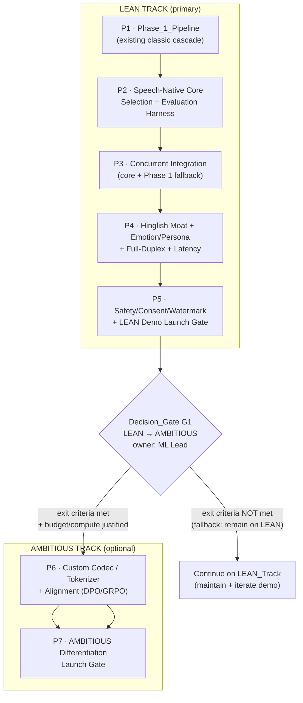
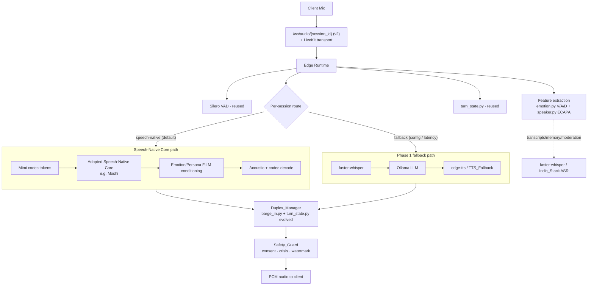

# Design Document

## Overview

This document is the design for the **SoulYatri speech-native voice roadmap**. The sole deliverable of this spec is a **planning artifact** — a single coherent, phased build plan with a primary **LEAN track** and an optional **AMBITIOUS track** gated by measurable decision gates. This spec **plans** model adoption, evaluation, and fine-tuning work; it **does not execute** any GPU-based model-training run, and it explicitly excludes from-scratch foundation-model pretraining.

The design reconciles three sources of truth that currently disagree:

1. **The code that already exists** — a Phase 1 classic cascade (`Audio → WebRTC → Silero VAD → faster-whisper STT → Ollama LLM → edge-tts TTS → Audio`) in `server/agent.py` and `server/pipeline/`, plus Phase 2 scaffolding (`turn_state.py`, `filler.py`, `emotion.py`, `speaker.py`, `barge_in.py`, `features.py`).
2. **The strategy PDFs** in `docs/` — the `SOULYATRI_MASTER_BIBLE.pdf` (funded custom-model program) versus the `VOX_OMEGA_FINAL_VERIFIED_60_DAY_PLAN.pdf` (fast solo demo, no from-scratch training).
3. **The 2026 open-source landscape** — full-duplex / any-to-any speech-native models that can be adopted directly, de-risking the "build a backbone" phase.

The central design decision: **adopt an existing open-source Speech-Native Core first (LEAN), measure it against an evaluation harness, ship a demo behind a launch gate, and only enter the AMBITIOUS custom-model track if a measurable decision gate justifies it.** Remaining on the LEAN track is always an allowed outcome.

### What this design produces

The roadmap is expressed as a set of **structured, machine-checkable planning objects** (phases, tracks, gates, selection criteria, budgets, licensing records) plus the **decision logic** that operates on them (gate evaluation, weighted model selection, code-switch scoring, consent/watermark guards). The decision logic is the part of this roadmap that is implementable as small pure functions and is therefore verifiable by property-based tests; the narrative phase plan is verified by structural/example checks.

### Research findings that inform the design

- **Moshi** (`kyutai/moshiko-pytorch-bf16`, `kyutai/moshika-pytorch-bf16`) is a full-duplex speech-text model with a documented theoretical latency of ~160 ms and ~200 ms in practice on an L4-class GPU. This directly supports the 200 ms stretch latency target. ([Moshi paper](https://arxiv.org/html/2410.00037v1), [kyutai/moshiko-mlx-q4 model card](https://huggingface.co/kyutai/moshiko-mlx-q4)) — *Content was rephrased for compliance with licensing restrictions.*
- **Mimi** (`kyutai/mimi`) is a streaming neural codec operating at 12.5 Hz and 1.1 kbps with an 80 ms frame size, fully causal — ideal token granularity for a streaming transformer and consistent with the 80 ms perceived-latency target. ([Moshi release notes](https://kyutai.org/2024/09/18/moshi-release.html)) — *Content was rephrased for compliance.*
- **Benchmark families** are real and current: **VoiceBench** (LLM-based voice assistants), **EmergentTTS-Eval** (prosody/expressiveness via model-as-judge), and **Seed-TTS-eval**, plus MUSHRA listening tests and Speech Arena. ([VoiceBench](https://arxiv.org/html/2410.17196v1), [EmergentTTS-Eval](https://arxiv.org/abs/2505.23009)) — *Content was rephrased for compliance.*

### Relationship to existing artifacts

- This roadmap is the **authoritative build plan** for all build-sequencing decisions and **supersedes every strategy PDF** in `docs/` (`SOULYATRI_MASTER_BIBLE.pdf`, `SOULYATRI_VOICE_AI_FINAL_BUILD_BIBLE.pdf`, `SOULYATRI_VOICE_AI_FINAL_BUILD_BIBLE_FIXED.pdf`, `VOX_OMEGA_FINAL_VERIFIED_60_DAY_PLAN.pdf`, `SILKPP_BUILD_BIBLE.pdf`, `SILKPP_Kill_List_Battle_Plan.pdf`, and `Building a single clean-room voice model that can outcompete Rumik, Sarvam, Hume and ElevenLabs.pdf`).
- It **references** the `.kiro/specs/ai-training-docs/` spec as the documentation/knowledge-base workstream and does **not** restate or redefine any documentation-generation requirement defined there.
- It traces every phase to a named section heading of `Soulyatri_Final_Speech_Native_Implementation_Guide.md`, with detailed per-phase tasks expanded in `soulyatri_final_speech_native_implementation_guide_expanded.md`.

## Architecture

### Roadmap-as-data architecture

The roadmap is modeled as a directed sequence of phases partitioned into two tracks, separated by a decision gate, with launch gates terminating each track's release. The planning objects and the decision logic that consumes them are the architecture.



### Runtime architecture the roadmap targets (speech-native)

The LEAN target architecture evolves the existing pipeline rather than replacing it. The Speech-Native Core runs **alongside** the Phase 1 pipeline, with a per-session runtime switch and a latency-triggered fallback.



Key architectural commitments:

- **Reuse, not rebuild.** Silero VAD, `turn_state.py`, `filler.py`, `barge_in.py`, `emotion.py` (V/A/D), and `speaker.py` (ECAPA) are carried forward. The Duplex_Manager is the evolution of `barge_in.py` + `turn_state.py`, not a from-scratch component.
- **Auxiliary STT retained.** faster-whisper and the Indic_Stack ASR models remain as auxiliary STT for transcripts, memory, and moderation after the core is adopted.
- **Transport continuity.** The existing `/ws/audio/{session_id}` protocol and LiveKit transport are preserved or assigned an explicit version identifier (v2) when the core is introduced.
- **Safety is in the LEAN demo scope**, not deferred to AMBITIOUS.

### Phase definitions and traceability

Each phase has a unique ordinal and identifier. The first phase is the existing Phase_1_Pipeline; the final phase is a speech-native SoulYatri_Platform. Every phase maps to at least one section heading of `Soulyatri_Final_Speech_Native_Implementation_Guide.md`.

| Ordinal | ID | Track | Phase | Implementation-guide section(s) |
|---|---|---|---|---|
| 1 | `P1-baseline` | LEAN | Phase_1_Pipeline (existing classic cascade) | "10. The actual implementation order → Phase 1 — production baseline" |
| 2 | `P2-core-select` | LEAN | Speech-Native Core selection + Evaluation Harness | "3. Recommended open-source stack"; "9B — Evaluation harness" |
| 3 | `P3-integrate` | LEAN | Concurrent integration (core + Phase 1 fallback) | "10 → Phase 2 — move to speech-native core"; "5. Final runtime architecture in detail" |
| 4 | `P4-moat-duplex` | LEAN | Hinglish moat + Emotion/Persona (FiLM) + Full-duplex + Latency | "10 → Phase 3 — emotion and persona / Phase 4 — filler latency masking / Phase 5 — full duplex"; "13. Latency engineering" |
| 5 | `P5-safety-gate` | LEAN | Safety/consent/watermark + LEAN Demo Launch Gate | "11.6 Safety subsystem"; "17. Launch criteria" |
| 6 | `P6-custom` | AMBITIOUS (optional) | Custom codec/tokenizer + alignment (DPO/GRPO) | "8. Fine-tuning strategy"; "16. Fine-tuning recipes" |
| 7 | `P7-diff-gate` | AMBITIOUS (optional) | AMBITIOUS Differentiation Launch Gate (final speech-native platform) | "17. Launch criteria"; "20. Final note on product strategy" |

The **LEAN_Track** (`P1`–`P5`) is labeled **primary**. The **AMBITIOUS_Track** (`P6`–`P7`) is labeled **optional** and is positioned after Decision_Gate `G1`.

### Conflict register (roadmap decisions vs. PDFs)

| Conflict topic | Conflicting PDF | Superseding decision | Rationale |
|---|---|---|---|
| Build custom model from forked weights up front | `SOULYATRI_MASTER_BIBLE.pdf` | Adopt an existing open-source Speech-Native Core first; defer custom work to AMBITIOUS behind `G1` | 2026 open-source full-duplex models are adoptable now; custom build is high cost/risk and not justified until evals show a gap |
| Reject all from-scratch / fine-tuning work for the demo | `VOX_OMEGA_FINAL_VERIFIED_60_DAY_PLAN.pdf` | Allow **lightweight** adaptation (LoRA/adapters) on Hinglish data when the core scores below the code-switch pass threshold | The moat (Hinglish) may need targeted adaptation even in LEAN; this is not large-scale training |
| Custom neural codec is a prerequisite | `SOULYATRI_VOICE_AI_FINAL_BUILD_BIBLE.pdf` | Use `kyutai/mimi` as the primary codec; custom codec is AMBITIOUS-only | Mimi is production-ready and streaming-optimized; a custom codec is a differentiation bet, not a baseline need |

## Components and Interfaces

The roadmap defines the following planning components. Each is described by its responsibility and the interface (inputs → outputs) of the decision logic it owns. The interfaces are specified so the logic can be implemented as pure, testable functions inside the roadmap's evaluation tooling.

### 1. Roadmap Model (`Roadmap`)

Holds the ordered phase list, track labels, gate definitions, and the conflict register. Responsibilities:

- Enforce that phase ordinals are unique and contiguous, the first phase is `P1-baseline`, and the final phase is a speech-native platform.
- Expose `phases`, `tracks`, `gates`, `conflicts`, and per-phase guide-section mappings.
- Carry the explicit scope statements (authoritative plan; supersedes PDFs; references `ai-training-docs`; excludes from-scratch pretraining and GPU-training execution; deliverable is a planning artifact).

### 2. Gate Evaluator (`GateEvaluator`)

The central decision-logic component for both Decision_Gates and Launch_Gates.

- **Input:** a gate definition (a set of criteria, each `{metric_name, threshold, operator}`), a set of measured values keyed by `metric_name`, and the current Licensing_Register state.
- **Output:** a `GateResult` with, for each criterion, `{metric_name, measured, threshold, operator, passed}`; an `overall_passed` boolean; and, when not passed, a `blocked=true` flag plus a `remediation` list naming each failing criterion and its corrective action.
- **Rule:** `overall_passed` is `true` **iff** every criterion passes **and** the Licensing_Register contains no unresolved compliance warning and no adopted component whose license prohibits its intended use.
- Decision_Gate `G1` additionally carries entry criteria, exit criteria, exactly one named owner role (**ML Lead**), and a fallback action (**remain on LEAN_Track**) used when exit criteria are not met.

### 3. Selection Scorer (`SelectionScorer`)

Selects the Speech-Native Core from Candidate_Models.

- **Input:** candidate scores per criterion for the six weighted criteria, the weight vector, and per-criterion minimum pass thresholds.
- **Output:** for each candidate, an aggregate weighted score and a `passes_all_minimums` flag; and an overall `selection` that is either the highest-aggregate passing candidate or `RETAIN_PHASE_1` when no candidate passes every minimum.

Weighted selection criteria (weights sum to 100%):

| Criterion | Weight | Minimum pass threshold (per-criterion score 0–100) |
|---|---|---|
| Streaming latency | 25 | ≥ 60 (maps to ≤ 300 ms p50 first-response) |
| Hindi/Hinglish capability | 25 | ≥ 60 |
| Full-duplex capability | 20 | ≥ 50 |
| License permissiveness | 15 | ≥ 70 (recognized OSS license, intended use permitted) |
| VRAM/compute footprint | 10 | ≥ 40 (fits the defined target hardware profile) |
| Community activity | 5 | ≥ 30 |

Verified 2026 Candidate_Models enumerated for the core: Moshi (`kyutai/moshiko-pytorch-bf16`, `kyutai/moshika-pytorch-bf16`), `Qwen/Qwen3-Omni-30B-A3B-Instruct`, `zai-org/glm-4-voice-9b`, `sesame/csm-1b`, `LiquidAI/LFM2.5-Audio-1.5B`, plus `stepfun-ai/Step-Audio-2-mini`, `openbmb/MiniCPM-o-4_5`, `CofeAI/FLM-Audio`, `tencent/Covo-Audio-Chat`, `OpenMOSS-Team/MOSS-Audio-4B-Instruct`, `gpt-omni/mini-omni2`. `sesame/csm-1b` and a TTS_Fallback (`hexgrad/Kokoro-82M`, `bosonai/higgs-audio-v2`, `SparkAudio/Spark-TTS`, `kyutai/tts-1.6b`) are designated reference/fallback generators, not the primary backbone. Codec: `kyutai/mimi` primary; `neuphonic/neucodec` and `HKUSTAudio/xcodec2` alternatives.

### 4. Evaluation Harness (`EvaluationHarness`)

Produces comparable scores across all Candidate_Models using the same metric set, the same input set, and the same scoring scale for every candidate.

- **Per-candidate metrics:** first-response latency (ms, p50), Hindi/Hinglish quality (code-switch quality metric), emotional expressiveness (numeric scale 0–100), license compatibility (categorical).
- **Run record:** `{model_id, revision, metric_scores, hardware{gpu_class, vram_gb}}`.
- **Reproducibility:** re-running ≥ 3 times on the same candidate and hardware yields, per metric, scores within a documented per-metric tolerance (latency ± 10%, quality ± 2 points, expressiveness ± 2 points).
- **Robustness:** a candidate that cannot be evaluated (missing weights, license restriction, hardware limit) is recorded with an exclusion category and reason; remaining candidates continue without aborting.
- **Cost:** runs with mocked inputs and/or small-sample inputs bounded by a documented maximum item count; requires no GPU model-training run.

### 5. Hinglish Data Engine (`HinglishDataEngine`)

Owns the code-switch moat.

- Sources consented code-switch conversational data in both Romanized and Devanagari variants, incorporating Indic_Stack resources (`ai4bharat/indic-conformer-600m-multilingual`, `shunyalabs/zero-stt-hinglish`, `ai4bharat/IndicF5`, `ai4bharat/indic-parler-tts`, `ai4bharat/IndicVoices`).
- **Transliteration interface:** `normalize(text) → {normalized_text, unmapped_tokens[]}`, using a deterministic Romanized↔Devanagari mapping (same input always yields the same output), applied for both input normalization and output rendering. Tokens with no mapping entry are retained unchanged and flagged as unmapped.
- **Code-switch quality metric:** `score(input, output) → percent`, where a response passes when its Hindi-to-English token ratio is within 15 percentage points of the input's ratio; the benchmark passes a build at ≥ 80%.
- When the adopted core scores below the 80% code-switch threshold, the roadmap specifies lightweight adaptation (LoRA/adapters) on the engine's output before any custom-model work.

### 6. Emotion/Persona Controller (`EmotionPersonaController`)

Carries forward the V/A/D representation already produced by `server/pipeline/emotion.py` and conditions output tone via FiLM-style conditioning.

- **Input:** discrete emotion tag from `{neutral, happy, sad, angry, fear, disgust, surprise}` and a continuous V/A/D vector, each dimension clamped to `[-1.0, 1.0]`.
- **`select_conditioning(features) → ConditioningMode`:**
  - If per-turn extraction failed/unavailable → `NEUTRAL` (V/A/D = 0,0,0; neutral tag); the turn continues uninterrupted.
  - Else if the dominant label is a distress label (`sad`/`angry`/`fear`) with confidence ≥ 0.50 → `EMPATHETIC` (calming conditioning) applied to every response turn for the duration of that state.
  - Else → `STANDARD` conditioning from the V/A/D vector and dominant label.
- Retains the wav2vec2-based SER model (`speechbrain/emotion-recognition-wav2vec2-IEMOCAP` or the currently configured equivalent) and the ECAPA-TDNN speaker encoder for feature extraction.

### 7. Duplex Manager (`DuplexManager`)

Evolution of `barge_in.py` + `turn_state.py` into full-duplex turn-taking.

- **Latency targets (target hardware profile):** practical first-response ≤ 300 ms p50; stretch ≤ 200 ms p50; perceived ≤ 80 ms p50 (via streaming output + cached filler phrases from `filler.py`).
- **Barge-in:** when ≥ 150 ms of voiced user speech is detected while the platform is producing audio, suppress current output within 200 ms of detection, and transition the turn state to `LISTENING` within 100 ms of detection — including from intermediate/processing states.
- **Latency fallback:** if the core does not emit its first audible response token within the 300 ms budget during a turn, complete that turn via the Phase_1_Pipeline (or a TTS_Fallback if Phase 1 is unavailable). This fallback is triggered **only** by latency-budget violations, not by other core failure types.
- **Mitigations** when the practical target is missed: quantization, a smaller core, or expanded filler coverage.

### 8. Safety Guard (`SafetyGuard`)

In scope for the LEAN demo.

- **Consent:** requires a recorded consent (`{speaker_id, permitted_use_scope, timestamp}`) before any voice is used for cloning/voice-style transfer. A request lacking valid consent is refused, the refusal is indicated to the requester, and the voice reference is not retained.
- **Watermarking:** every synthesized output, on **every** path (including fallback paths), carries a watermark detectable by a watermark detector.
- **Crisis:** when the crisis classifier labels speech as self-harm/crisis at or above its decision threshold, the guard surfaces crisis-support guidance to the user **and** flags the turn for human review.
- **Consent log:** maintained for every product-facing voice (`{speaker_id, permitted_use_scope, timestamp}`) and retained while the voice remains in product-facing use.

### 9. Licensing Register (`LicensingRegister`)

- Records, **before use**, `{component_name, license_id, constraints}` for every adopted model/dataset/tool; only recognized OSS license identifiers are permitted.
- If license recording fails, adoption may proceed but a compliance warning identifying the component is raised and retained as **unresolved** until the information is recorded.
- Records every excluded Candidate_Model with its exclusion reason (licensing or non-licensing such as performance/compatibility).
- Flags any dataset whose terms restrict redistribution or require subject consent, recording the specific restriction type; while flagged, the Hinglish Data Engine excludes that dataset's content from any redistributed output until the restriction is satisfied.
- Reviewed at every Launch_Gate; an unresolved warning or a prohibiting license blocks the corresponding release.

### 10. Budget & Compute Planner (`BudgetComputePlanner`)

- States, per phase, a compute footprint as minimum GPU class + minimum VRAM (GB).
- States a LEAN budget range and an AMBITIOUS budget range, each as `{lower, upper, currency}` (single stated currency, USD).
- Asserts the LEAN track is executable by ≤ 5 people without large-scale GPU training (multi-GPU/multi-node from-scratch training).
- **`select_scope(phase, available_compute)`:** when available compute is below the phase minimum, is zero, or is invalid/missing, returns a reduced-scope alternative whose stated footprint does not exceed the compute confirmed available.
- Requires, before AMBITIOUS is entered at `G1`, an explicit justification including the AMBITIOUS budget range and per-phase compute footprint.

## Data Models

The roadmap's planning objects are flat, serializable structures. These are the canonical models that the decision logic operates on.

```python
# --- Phases, tracks, gates ---
Track = Literal["LEAN", "AMBITIOUS"]

@dataclass
class Phase:
    ordinal: int                 # unique, contiguous; P1 == 1
    id: str                      # unique, e.g. "P2-core-select"
    track: Track
    title: str
    is_speech_native: bool
    guide_sections: list[str]    # >=1 heading from the implementation guide
    compute_min_gpu_class: str   # e.g. "L4", "A10G", "A100-40GB"
    compute_min_vram_gb: float

@dataclass
class GateCriterion:
    metric_name: str
    threshold: float
    operator: Literal["<=", "<", ">=", ">", "=="]

@dataclass
class Gate:
    id: str
    kind: Literal["decision", "launch"]
    entry_criteria: list[GateCriterion]
    exit_criteria: list[GateCriterion]
    owner_role: str              # exactly one named role
    fallback_action: str         # e.g. "remain on LEAN_Track"

@dataclass
class CriterionResult:
    metric_name: str
    measured: float
    threshold: float
    operator: str
    passed: bool

@dataclass
class GateResult:
    gate_id: str
    criteria_results: list[CriterionResult]
    overall_passed: bool
    blocked: bool
    remediation: list[str]       # one entry per failing criterion when blocked

# --- Model selection ---
SELECTION_WEIGHTS = {            # sum == 100
    "streaming_latency": 25, "hinglish_capability": 25, "full_duplex": 20,
    "license_permissiveness": 15, "vram_footprint": 10, "community_activity": 5,
}
SELECTION_MINIMUMS = {
    "streaming_latency": 60, "hinglish_capability": 60, "full_duplex": 50,
    "license_permissiveness": 70, "vram_footprint": 40, "community_activity": 30,
}

@dataclass
class CandidateScores:
    model_id: str
    revision: str
    scores: dict[str, float]     # criterion -> 0..100

@dataclass
class SelectionOutcome:
    selected: str                # model_id or "RETAIN_PHASE_1"
    aggregates: dict[str, float] # model_id -> weighted aggregate
    passing: list[str]           # model_ids meeting all minimums

# --- Evaluation harness ---
@dataclass
class HarnessRun:
    model_id: str
    revision: str
    metric_scores: dict[str, float]   # latency_ms_p50, codeswitch_quality, expressiveness
    license_compat: Literal["compatible", "restricted", "prohibited"]
    hardware: dict                    # {"gpu_class": str, "vram_gb": float}
    excluded: bool = False
    exclusion_category: Optional[str] = None  # missing_weights|license|hardware
    exclusion_reason: Optional[str] = None

# --- Emotion / persona ---
@dataclass
class EmotionFeatures:
    label: str                   # one of the 7 tags, or None if extraction failed
    confidence: float            # 0..1
    valence: float               # clamped [-1, 1]
    arousal: float               # clamped [-1, 1]
    dominance: float             # clamped [-1, 1]
    extraction_ok: bool

ConditioningMode = Literal["NEUTRAL", "EMPATHETIC", "STANDARD"]

# --- Safety ---
@dataclass
class ConsentRecord:
    speaker_id: str
    permitted_use_scope: str
    timestamp: float             # required; presence of all three == valid consent

@dataclass
class CloningDecision:
    allowed: bool
    reason: str
    reference_retained: bool     # must be False when refused

# --- Licensing ---
@dataclass
class LicenseEntry:
    component_name: str
    license_id: Optional[str]    # recognized OSS id, or None if recording failed
    constraints: list[str]
    intended_use_permitted: bool
    recorded_before_use: bool
    redistribution_restricted: bool = False
    restriction_type: Optional[str] = None

@dataclass
class ComplianceWarning:
    component_name: str
    resolved: bool

# --- Hinglish normalization ---
@dataclass
class NormalizationResult:
    normalized_text: str
    unmapped_tokens: list[str]   # retained unchanged in normalized_text, flagged here
```

Design notes on the models:

- `GateResult.overall_passed` is a pure function of `criteria_results` and the Licensing_Register; it never depends on hidden state.
- `SelectionOutcome.selected` is `RETAIN_PHASE_1` exactly when `passing` is empty, and otherwise the `argmax` of `aggregates` restricted to `passing`.
- `EmotionFeatures` always exposes clamped V/A/D so downstream conditioning cannot receive out-of-range values.
- A `ConsentRecord` is **valid** only when `speaker_id`, `permitted_use_scope`, and `timestamp` are all present and non-empty.

## Correctness Properties

*A property is a characteristic or behavior that should hold true across all valid executions of a system — essentially, a formal statement about what the system should do. Properties serve as the bridge between human-readable specifications and machine-verifiable correctness guarantees.*

Although the deliverable is a planning artifact, the roadmap **defines decision logic** that is pure and input-varying: gate evaluation, weighted model selection, code-switch scoring, transliteration normalization, emotion conditioning selection, duplex/barge-in timing decisions, consent/watermark guards, and licensing-gate blocking. These functions have universal properties that should hold across all valid inputs, so they are specified here as property-based tests. The narrative/structural acceptance criteria (track labels, enumerations, scope statements, target values, citations) are verified by example/structural checks described in the Testing Strategy and are intentionally **not** listed as properties.

Each property below was derived from the prework analysis and consolidated to remove redundancy.

### Property 1: Phase-structure invariant

*For any* roadmap phase list, the phase ordinals are unique and contiguous starting at 1, the phase identifiers are unique, the first phase is the existing Phase_1_Pipeline, the final phase is speech-native, and every phase carries at least one implementation-guide section heading and a compute footprint (minimum GPU class and minimum VRAM in GB).

**Validates: Requirements 1.1, 1.6, 9.1**

### Property 2: Gate evaluation, blocking, remediation, and licensing block

*For any* gate definition (a set of criteria each expressed as a metric name, numeric threshold, and comparison operator), any set of measured values, and any Licensing_Register state, the gate evaluator resolves each criterion to exactly one pass/fail result consistent with its operator; the overall result is pass **if and only if** every criterion passes **and** the register contains no unresolved compliance warning and no adopted component whose license prohibits its intended use; and whenever the overall result is not pass, the release is marked blocked with a remediation entry naming each failing criterion (and a Decision_Gate additionally yields its single named owner and a fallback action that is allowed to be "remain on LEAN_Track").

**Validates: Requirements 1.4, 1.5, 8.4, 8.5, 11.5, 11.7**

### Property 3: Speech-Native Core selection

*For any* set of Candidate_Model scores against the six weighted selection criteria, the selector scores every candidate against every criterion; if no candidate meets every per-criterion minimum threshold the selection is RETAIN_PHASE_1; and if at least one candidate meets every minimum the selection is the candidate with the highest weighted aggregate score among those that meet every minimum.

**Validates: Requirements 2.4, 2.7, 2.9**

### Property 4: Evaluation harness comparability and record completeness

*For any* set of evaluated Candidate_Models, every produced run record uses the identical metric key set and the identical scoring scale, and each record contains the model identifier, the model version/revision, a first-response latency (ms, p50), a Hindi/Hinglish code-switch quality score, a numeric emotional-expressiveness score, a categorical license-compatibility value, and the hardware used expressed as GPU class and VRAM in GB.

**Validates: Requirements 4.1, 4.2, 4.3**

### Property 5: Exclusion recording without abort

*For any* set of Candidate_Models in which some cannot be evaluated (missing weights, license restriction, or hardware limit) or are otherwise excluded, each such model is recorded with an exclusion category and reason, and every remaining evaluable model still produces a complete score record (the run does not abort).

**Validates: Requirements 4.5, 11.4**

### Property 6: Harness reproducibility within tolerance

*For any* Candidate_Model evaluated at least three times on the same (mocked) inputs and same hardware, the per-metric scores across runs fall within the documented per-metric tolerance.

**Validates: Requirements 4.4**

### Property 7: Code-switch quality scoring and pass threshold

*For any* code-switched input and the corresponding response, the code-switch quality decision is "within tolerance" if and only if the absolute difference between the response's Hindi-to-English token ratio and the input's Hindi-to-English token ratio is at most 15 percentage points; and *for any* evaluation-set score, the build passes the Hinglish benchmark if and only if the score is at least 80 percent.

**Validates: Requirements 5.4, 5.6**

### Property 8: Transliteration determinism and unmapped-token handling

*For any* input string, normalizing it repeatedly always produces the identical normalized output (deterministic, in both input-normalization and output-rendering directions); and *for any* input token that has no entry in the transliteration mapping, that token appears unchanged in the normalized output and is also reported in the unmapped-token list.

**Validates: Requirements 5.5, 5.8**

### Property 9: Emotion/persona conditioning selection

*For any* per-turn emotion features, the conditioning selector exposes valence, arousal, and dominance values each within the inclusive range -1.0 to 1.0; selects neutral conditioning (V/A/D = 0,0,0 with the neutral tag) when extraction is unavailable or failed; selects empathetic/calming conditioning when the dominant label is a distress label (sad, angry, or fear) with confidence at least 0.50; and otherwise selects standard conditioning derived from the features — and in every case the turn is allowed to continue.

**Validates: Requirements 6.1, 6.3, 6.5, 6.7**

### Property 10: Barge-in suppression and listening transition

*For any* turn in which at least 150 milliseconds of voiced user speech is detected while the platform is producing audio, the duplex manager schedules suppression of the current output within 200 milliseconds of detection and transitions the turn state to a listening state within 100 milliseconds of detection, regardless of the prior state including intermediate or processing states.

**Validates: Requirements 7.4, 7.5**

### Property 11: Latency-only fallback discrimination

*For any* turn outcome, the platform completes the turn using the Phase_1_Pipeline (or a TTS_Fallback when Phase 1 is unavailable) if and only if the Speech-Native Core fails to emit its first audible response token within the 300 millisecond budget; non-latency core failure types alone do not trigger this latency fallback.

**Validates: Requirements 3.5**

### Property 12: Watermark on every output path

*For any* synthesized speech output produced on any output path, including fallback paths, the applied audio watermark is present and is reported as detected by the watermark detector.

**Validates: Requirements 10.2**

### Property 13: Consent gating and consent-log completeness

*For any* voice-cloning or voice-style-transfer request, the request is allowed if and only if a valid consent record (speaker identifier, permitted-use scope, and timestamp all present) exists; when the request is refused the refusal is indicated and no voice reference is retained; and every voice recorded in the product-facing consent log carries the speaker identifier, permitted-use scope, and consent timestamp.

**Validates: Requirements 10.1, 10.3, 10.6**

### Property 14: Crisis handling

*For any* crisis-classifier output, crisis-support guidance is surfaced to the user **and** the turn is flagged for human review if and only if the classification score is at or above the decision threshold.

**Validates: Requirements 10.4, 10.5**

### Property 15: Licensing register and redistribution exclusion

*For any* adopted component, the Licensing_Register records its name, an open-source license identifier, and its constraints before the component is used; if license recording fails, adoption may proceed but an unresolved compliance warning identifying the component is retained until the information is recorded; any dataset whose terms restrict redistribution or require subject consent is flagged with its specific restriction type; and *for any* redistributed Hinglish_Data_Engine output, no content originates from a dataset that is currently flagged as restricting redistribution or requiring consent.

**Validates: Requirements 11.1, 11.2, 11.3, 11.6, 11.8**

## Error Handling

The roadmap's decision logic is designed to fail safe (closed), preferring the conservative outcome whenever inputs are missing, invalid, or degraded.

- **Gate evaluation with missing metrics.** If a measured value for a gate criterion is absent, the criterion resolves to **fail** (not pass), forcing the gate to block rather than declaring a release ready on incomplete evidence (Req 8.4, 8.5).
- **Model selection with no qualifying candidate.** When no Candidate_Model meets every minimum, selection returns `RETAIN_PHASE_1` so the product never regresses to a non-functional state (Req 2.7).
- **Un-evaluable candidates.** Missing weights, license restriction, or hardware limits are caught per candidate, recorded as an exclusion (category + reason), and the harness continues with the rest — a single bad candidate never aborts the run (Req 4.5).
- **Emotion extraction failure.** Any failure or unavailability of per-turn emotion extraction yields neutral conditioning (V/A/D = 0,0,0, neutral tag) and the turn continues uninterrupted; out-of-range V/A/D inputs are clamped to `[-1.0, 1.0]` (Req 6.1, 6.7). This mirrors the existing fail-safe behavior already in `server/pipeline/emotion.py` and `features.py`, which return neutral/zeroed results on error.
- **Latency budget violation.** If the Speech-Native Core does not produce its first audible token within 300 ms, the Duplex_Manager completes the turn on the Phase_1_Pipeline (or TTS_Fallback). Crucially, this fallback is gated to latency violations only; other core failures follow their own handling paths and do not silently mask as latency events (Req 3.5).
- **Barge-in during intermediate states.** The turn-state machine (already enforcing `VALID_TRANSITIONS` and state timeouts in `turn_state.py`) must accept a barge-in transition to `LISTENING` from any active state within 100 ms; transitions that the machine would otherwise reject are handled by an explicit interrupt path so a new utterance is never dropped (Req 7.5).
- **Consent absent or partial.** A cloning request with missing or partial consent (any of speaker id / scope / timestamp absent) is refused, the refusal is surfaced, and the reference is not retained — fail closed (Req 10.3).
- **License recording failure.** Adoption is allowed to proceed to avoid blocking engineering, but an unresolved compliance warning is raised and retained; at the next Launch_Gate review the unresolved warning blocks the release until resolved (Req 11.3, 11.7).
- **Invalid/zero/missing compute data.** `BudgetComputePlanner.select_scope` treats invalid, zero, or missing availability as "insufficient" and returns a reduced-scope alternative whose footprint does not exceed the confirmed-available compute (Req 9.5).
- **Restricted datasets.** While a dataset is flagged as restricting redistribution or requiring consent, its content is excluded from any redistributed output until the restriction is satisfied (Req 11.8).
- **Watermark detector failure.** If watermark application cannot be verified on an output path, that output is treated as non-compliant and the path is flagged rather than emitting unwatermarked audio (Req 10.2).

## Testing Strategy

The roadmap is validated with a **dual approach**: property-based tests for the decision logic and example/structural tests for the narrative planning artifact. Both are necessary — property tests verify the logic holds across all inputs, while structural tests verify the document contains the required statements, enumerations, targets, and citations.

### Property-Based Tests (for the decision logic)

- **Library.** Use **Hypothesis** (Python), matching the existing `server/` Python codebase. Do not implement property-based testing from scratch.
- **Iterations.** Configure each property test to run a minimum of **100 iterations** (`@settings(max_examples=100)` or higher).
- **Tagging.** Tag each property test with a comment referencing its design property, in the format:
  `# Feature: speech-native-voice-roadmap, Property {number}: {property_text}`
- **Coverage.** Implement each of the 15 correctness properties as a **single** property-based test, with generators that cover edge cases:
  - Generators produce out-of-range V/A/D values, empty/whitespace and unmapped transliteration tokens, candidate sets where zero/one/many candidates pass minimums, gates with missing measurements, zero/invalid compute availability, partial consent records, and Hindi/English token ratios spanning 0–100%.
  - Property 6 (reproducibility) and Property 4 (comparability) run against a **mocked** harness with bounded, small-sample inputs — no GPU and no model-training run is invoked (Req 4.6).
  - Property 12 (watermark) and Property 10/11 (duplex timing) use mocked output paths and simulated clocks rather than real audio synthesis, keeping the tests deterministic and fast.

### Example and Structural Tests (for the planning artifact)

Example-based tests assert the roadmap document and its planning objects contain required content. These cover the EXAMPLE/SMOKE criteria from the prework:

- **Track and gate structure.** LEAN labeled primary, AMBITIOUS labeled optional and positioned after the decision gate; at least one Decision_Gate between the tracks; each conflict-register row has topic + superseding decision + rationale (Req 1.2, 1.3, 1.7).
- **Enumerations and designations.** Candidate_Model list, codec primary/alternatives, `csm-1b`/TTS_Fallback as reference-only, Indic_Stack resources, benchmark families (VoiceBench, EmergentTTS-Eval, Seed-TTS-eval, MUSHRA, Speech Arena), competitive targets (ElevenLabs, Hume, Rumik/Silk, Sarvam), and selection-weight table summing to 100 with a minimum per criterion (Req 2.2, 2.3, 2.5, 2.6, 5.3, 8.1, 8.6).
- **Migration and reuse statements.** Concurrent-run stage, per-session runtime fallback switch, reuse of Silero VAD / `turn_state.py` / `filler.py`, retained auxiliary STT, WebSocket/LiveKit continuity or version id, and Duplex_Manager evolution (Req 3.1, 3.2, 3.3, 3.4, 3.6, 7.6).
- **Targets and policies.** Latency targets (300 ms practical / 200 ms stretch / 80 ms perceived), mitigation list, lightweight-adaptation-before-custom policy, FiLM mechanism, retained SER + ECAPA models, budget ranges (lower ≤ upper, single currency), ≤ 5-person LEAN claim, AMBITIOUS justification requirement, and safety-in-LEAN-scope (Req 5.1, 5.2, 5.7, 6.2, 6.4, 6.6, 7.1, 7.2, 7.3, 7.7, 9.2, 9.3, 9.4, 10.7).
- **Scope and relationship statements.** Authoritative-plan/supersedes-PDFs statement, reference to `ai-training-docs`, no restating of its doc-gen requirements, exclusion of from-scratch pretraining, exclusion of GPU training-run execution, planning-artifact-only declaration, and that every PDF citation matches an exact file name in `docs/` (Req 12.1–12.7).
- **PDF citation check.** A small test asserts each `docs/` file name referenced in the roadmap exists in the `docs/` directory listing (Req 12.6).

### Unit and Integration Tests

- **Unit tests** cover specific worked examples and boundary cases that complement the properties: e.g., a gate with exactly one failing criterion produces a single remediation entry; the selection tie-break behavior; a distress label at exactly confidence 0.50 selects empathetic conditioning; a barge-in from the `THINKING` state reaches `LISTENING`.
- **Integration test (1–3 examples).** A single end-to-end pass of the mocked Evaluation_Harness over a small fixed candidate set, asserting comparable records and a deterministic selection — verifying the harness wiring, not re-testing the universal properties.

Keep unit tests focused on concrete examples and integration points; rely on the property tests for broad input coverage so the suite stays fast and does not duplicate coverage.
