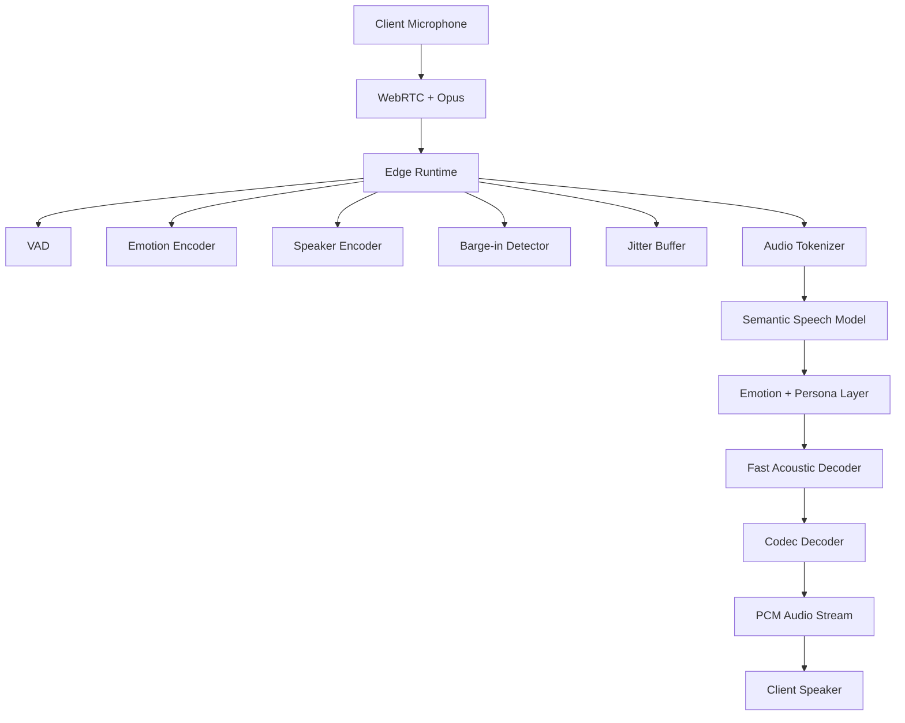
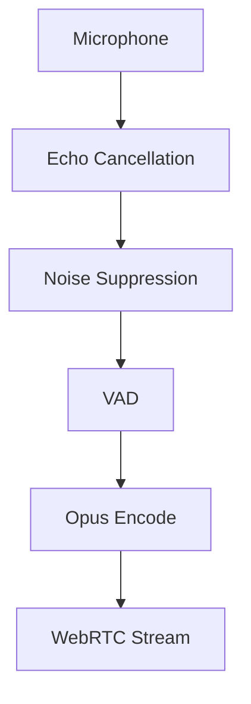
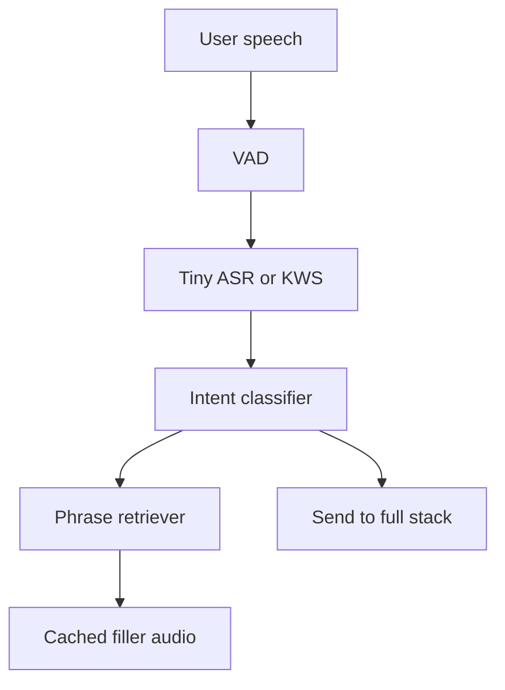
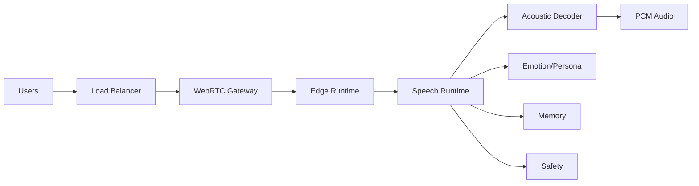
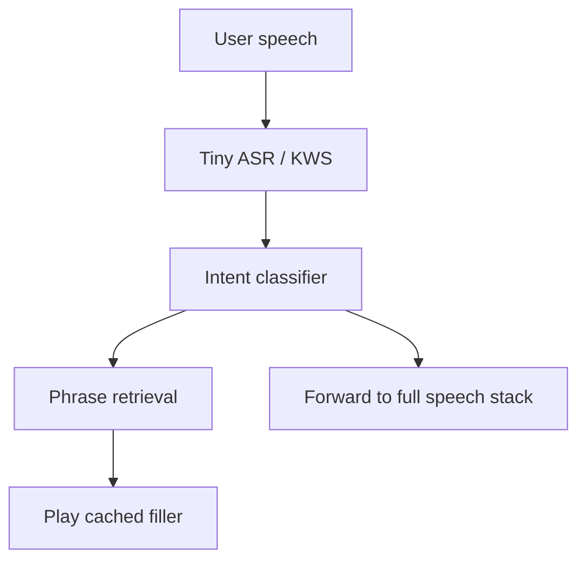

# SOULYATRI — Final Production Implementation Guide
## Speech-Native Realtime Emotional Voice AI (Open Source Only)

**Goal:** build a production-grade, low-latency, speech-native, full-duplex conversational voice system that works for many concurrent users, supports Hindi + English + Hinglish, and is deployable with open-source components only.

**Primary design choice:** do **not** build a scratch foundation model. Use a **speech-native runtime** as the core, then add small auxiliary models only where they help latency, safety, memory, and tooling.

---

# 0. What this system is

This is **not** a classic pipeline product.

Classic voice stack:

```text
Audio → STT → LLM → TTS → Audio
```

This system:

```text
Audio → codec tokens → speech-native semantic model → codec tokens → Audio
```

The important consequence is that the system treats speech as a first-class modality. It preserves:
- pauses
- interruptions
- intonation
- laughter
- emotional contour
- speaking rhythm
- turn-taking

That is why the architecture feels natural.

---

# 1. Design principles

## 1.1 Non-negotiable constraints

1. **Open source only**
2. **No scratch training**
3. **Minimal latency**
4. **Accurate enough to ship**
5. **Production-safe**
6. **Scales to many concurrent users**
7. **Speech-native first**
8. **Tiny client-side helper model**
9. **Fallbacks for robustness**
10. **Fine-tune only where it measurably improves product quality**

---

## 1.2 What the product should feel like

- The assistant should start responding fast.
- It should interrupt naturally and recover cleanly.
- It should sound emotionally aware.
- It should speak Hinglish naturally.
- It should not feel like a text bot speaking aloud.
- It should mask latency with micro-fillers when appropriate.
- It should stay stable under concurrent load.

---

# 2. Final high-level architecture

## 2.1 Primary architecture



---

## 2.2 Key idea

The **main speech model** is a **speech-native conversational model**, not a text LLM.  
Text remains auxiliary for:
- memory
- logging
- moderation
- search
- tool use
- analytics
- fine-tuning data prep

---

# 3. Recommended open-source stack

This section gives the practical choices for production.

## 3.1 Transport and client runtime

| Layer | Recommended choice | Why |
|---|---|---|
| Realtime transport | LiveKit + WebRTC | low latency, production-ready |
| Audio codec | Opus | stable, efficient, realtime optimized |
| Echo cancellation | WebRTC AEC | standard client-side cleanup |
| Noise suppression | RNNoise | lightweight and real-time |
| VAD | Silero VAD | fast and reliable |
| Client app | Next.js web + native mobile if needed | easy ship path |
| Audio core | Rust or C++ | low-latency on client |

---

## 3.2 Core speech-native model stack

| Role | Primary open-source choice | Why |
|---|---|---|
| Semantic speech runtime | **Moshi** | full-duplex spoken dialogue framework |
| Audio codec | **Mimi** | streaming neural audio codec used by Moshi |
| Semantic enhancement / fallback speech model | **CSM** | conversational speech generation model using RVQ audio codes |
| Codec fallback | SNAC or DAC | practical alternatives |
| Auxiliary text LLM | Qwen3 or Llama 3.3 | open-weight reasoning and tool use |
| Auxiliary STT | faster-whisper or IndicConformer | logs, memory, moderation, tools |
| Tiny client speech helper | sherpa-onnx | tiny on-device ASR / KWS / routing |

### Best current recommendation
- **Primary realtime brain:** Moshi
- **Primary codec:** Mimi
- **Fallback speech generator / reference path:** CSM
- **Auxiliary text brain:** Qwen3 or Llama 3.3
- **Tiny client helper:** sherpa-onnx

---

## 3.3 Why this is the right stack

- **Moshi** is already designed as a full-duplex spoken dialogue framework and uses **Mimi**.  
- **CSM** generates RVQ audio codes from text and audio inputs.  
- **Mimi** is the codec bridge that makes streaming speech-native systems practical.  
- **Qwen3 / Llama 3.3** are used only where text reasoning is still the better tool.  
- **sherpa-onnx** gives a tiny, local, offline-friendly client helper path.

---

# 4. What each model does

## 4.1 Mimi — audio tokenization

### Role
Convert waveform into discrete audio tokens.

### Why it matters
Speech-native models do not want raw audio waveforms directly. They want compact discrete representations that preserve prosody and timing.

### Output
A sequence of codec tokens, often thought of as:
- coarse semantic audio
- prosody bands
- fine acoustic bands

### Use in this system
- tokenizes user speech
- tokenizes model output before waveform reconstruction
- acts as the bridge between audio and the speech-native model

---

## 4.2 Moshi — the main speech-native model

### Role
This is the core conversational brain.

### What it does
- consumes speech tokens
- tracks conversational state
- predicts speech responses
- supports full-duplex behavior
- streams output continuously

### What it is not
- not a classic STT
- not a classic TTS
- not a text-only chat model

### Why it is the primary model
It matches the desired architecture:
- speech-in
- speech-out
- streaming
- duplex
- low latency

---

## 4.3 CSM — semantic speech fallback / enhancer

### Role
A strong speech generation model that can be used as:
- fallback generator
- bootstrapping path
- quality reference
- data generation assistant

### Good use cases
- early product fallback if Moshi path is unstable
- generating candidate response speech
- building synthetic speech datasets
- voice style transfer experiments

---

## 4.4 Qwen3 or Llama 3.3 — auxiliary text intelligence

### Role
Used only when explicit text reasoning helps:
- tool use
- RAG
- memory summarization
- safety policy decisions
- offline analysis
- dataset generation
- debugging

### Recommendation
- Use a smaller model for low latency.
- Use a larger model only where the output matters more than speed.

---

## 4.5 faster-whisper / IndicConformer — auxiliary STT

### Role
Not the core realtime brain.  
Use this for:
- transcripts
- search
- memory extraction
- moderation review
- analytics
- fallback if speech-native pipeline fails

### Recommendation
- **faster-whisper** for general fast transcription
- **AI4Bharat IndicConformer** for Indian language coverage

---

## 4.6 sherpa-onnx — tiny client-side model

### Role
This is the lightweight on-device piece for:
- VAD-assisted routing
- wake-word / keyword spotting
- tiny speech intent detection
- fast routing to filler responses
- trivial command recognition

This is the part you asked for where the client can quickly decide whether to:
- play a cached filler phrase
- send to full stack
- handle a very short response locally

### Good patterns
- use tiny ASR / KWS for phrase detection
- use a small intent classifier on the transcript
- match against a phrase bank of cached filler responses

---

# 5. Final runtime architecture in detail

## 5.1 Client layer



### Client responsibilities
- capture audio
- suppress echo
- suppress noise
- detect voice activity
- send audio frames to server
- receive assistant audio stream
- play output immediately

### Client-side technical notes
- keep audio frames small
- avoid heavy encoding
- avoid transcoding on the client if possible
- use Opus only for transport, not as internal model input
- keep local buffers short

### Recommended client stack
- Web: Next.js + WebAudio + WebRTC
- Native: Rust audio core + platform UI
- Mobile: React Native if you need a shared UI codebase

---

## 5.2 Edge runtime

This layer runs close to users and should be fast.

### Responsibilities
- speech activity detection
- speaker tracking
- emotional state estimation
- barge-in detection
- turn end prediction
- jitter smoothing
- session routing

### Components

| Component | What it does |
|---|---|
| VAD | detects when speech starts/ends |
| Emotion encoder | estimates emotional state from audio |
| Speaker encoder | tracks speaker identity and voice consistency |
| Barge-in detector | detects interruption while AI is speaking |
| Jitter buffer | smooths packet timing |

### Recommended models / tools
- **Silero VAD**
- **ECAPA-TDNN** for speaker embeddings
- **wav2vec2-based emotion model**
- custom lightweight turn detector

---

## 5.3 Audio tokenizer

### Responsibilities
- convert waveform into codec tokens
- preserve rhythm and prosody
- compress speech into discrete units

### Recommended codec order
1. Mimi
2. SNAC
3. DAC

### Production recommendation
Use **Mimi** as the primary path.

---

## 5.4 Semantic speech model

This is the actual intelligence core.

### What it consumes
- codec tokens
- speaker state
- emotional state
- previous conversation context
- memory summaries
- optional auxiliary text context

### What it outputs
- next speech tokens
- conversational continuation
- emotional contour
- interruption-aware continuation
- turn-taking behavior

### Required behavior
- streaming decode
- low look-ahead
- incremental generation
- rollback on interruption
- conversation state preservation

---

## 5.5 Emotion + persona layer

### Why this exists
A speech-native model must preserve style, not just content.

### What it conditions
- tone
- warmth
- humor
- uncertainty
- empathy
- confidence
- speed
- pause frequency

### Recommended format
Use continuous latent vectors instead of only discrete tags.

Example:

```json
{
  "valence": 0.62,
  "arousal": 0.31,
  "dominance": 0.58,
  "warmth": 0.80,
  "uncertainty": 0.14,
  "intensity": 0.47
}
```

### Conditioning method
- FiLM layers
- cross-attention to emotional latents
- speaker embedding fusion
- persona memory injection

---

## 5.6 Fast acoustic decoder

### Role
Transform high-level speech tokens into fine acoustic tokens.

### Why separate this layer
It lets the system:
- stream faster
- keep semantic reasoning separate from waveform detail
- scale better under load
- optimize with smaller model footprints

### Production direction
- keep it small
- quantize aggressively
- stream chunks continuously
- avoid full-sentence blocking

---

## 5.7 Codec decoder

### Role
Convert codec tokens back into waveform.

### Requirements
- low latency
- stable streaming
- no large buffering
- support chunked output

### Output
PCM audio streamed back to the client.

---

# 6. The filler-word / cached phrase system

This is a separate latency masking layer.

## 6.1 What it is

A tiny local or edge-side subsystem that:
- detects trivial or repeatable speech situations
- plays a cached filler or short response
- buys time while the main stack is processing
- avoids dead air
- improves perceived latency

## 6.2 Important design rule

This system should **mask latency**, not replace the main AI when the task is non-trivial.

Use it for:
- “one sec”
- “hmm”
- “got it”
- “wait, let me check”
- “interesting”
- “haan”
- “samjha”
- “just a moment”

and for short templated acknowledgements.

## 6.3 Two-layer filler design

### Layer A — trivial fast response
Use a local heuristic / tiny model to classify:
- greeting
- acknowledgment
- short answer
- wait-needed
- command
- uncertain / escalate

If it is trivial, emit a cached phrase immediately.

### Layer B — latency sponge
While the main pipeline is processing:
- play a cached filler
- stretch the response by 300–700 ms
- then smoothly hand over to the real output

## 6.4 How to implement filler selection

### Local pipeline


### Retrieval strategy
Store a large phrase bank:
- greetings
- acknowledgments
- fillers
- confirmations
- empathy phrases
- repair phrases
- stall phrases
- short instructions

Index them by:
- intent
- length
- emotion
- language
- gender / voice style
- tempo
- confidence score

### Suggested matching pipeline
1. tiny ASR or keyword spotting on the client
2. lightweight intent classification
3. semantic similarity against phrase bank
4. if confidence high, play cached audio
5. in parallel, still send the turn to the main stack

### Phrase bank size
Thousands of phrases is fine.

Recommended metadata fields:
- text
- language
- intent tag
- emotion tag
- duration
- voice id
- speed
- use case
- confidence threshold

## 6.5 Best practice
Do not make the filler system too clever.  
It should be:
- fast
- stable
- predictable
- safe
- easy to disable

---

# 7. Final open-source model recommendations

## 7.1 Core speech-native stack

| Task | Model / tool | Recommendation |
|---|---|---|
| Realtime spoken dialogue | Moshi | primary |
| Streaming neural audio codec | Mimi | primary |
| Speech generation fallback | CSM | secondary |
| Tiny client routing | sherpa-onnx | primary |
| STT fallback | faster-whisper | primary |
| Indic STT fallback | AI4Bharat IndicConformer | primary for Indian languages |

## 7.2 Auxiliary reasoning and memory

| Task | Model / tool | Recommendation |
|---|---|---|
| Main text reasoning | Qwen3 or Llama 3.3 | primary |
| Embeddings | multilingual-e5 | retrieval |
| Vector DB | Qdrant | recommended |
| Hot memory | Redis | recommended |
| Relational memory | Postgres | recommended |

## 7.3 Emotion and speaker layers

| Task | Model / tool | Recommendation |
|---|---|---|
| Speaker embeddings | ECAPA-TDNN | primary |
| Emotion recognition | wav2vec2-based SER model | primary |
| Speech emotion datasets | EmoV-DB, RAVDESS, SER collections | training / evaluation |

---

# 8. Fine-tuning strategy

You do not want scratch training. Good.  
So fine-tune only where it materially improves the product.

## 8.1 What to fine-tune first

1. **Auxiliary STT** if Hindi-English accuracy is weak
2. **Emotion encoder** if emotional recognition is unreliable
3. **Filler selector / intent router** if cached phrase matching is poor
4. **Voice style / speaking style** if you need stronger brand consistency
5. **Main speech model adapters** only if the open model is close enough to your target but misses Hinglish style or pacing

## 8.2 What not to fine-tune too early

- do not pretrain from scratch
- do not rewrite the whole speech codec first
- do not start with full foundation training
- do not spend time on giant model training before proving latency and quality

---

# 9. Fine-tuning datasets

## 9.1 For speech recognition / transcript quality

| Dataset | Why it matters |
|---|---|
| IndicVoices | high-value Indian speech coverage |
| Common Voice | broad multilingual diversity |
| AI4Bharat datasets | Indian language ASR |
| MLS | multilingual speech |
| Whisper-style public speech corpora | robustness |
| your own consented recordings | domain adaptation |

### IndicVoices
Very important because it includes broad Indian language coverage and conversational speech.

### Common Voice
Useful for multilingual diversity and generalization.

---

## 9.2 For speaker identity and cloning-like behavior

| Dataset | Why it matters |
|---|---|
| VoxCeleb1 / VoxCeleb2 | speaker embeddings and speaker variation |
| consented studio recordings | product voice consistency |

### Important
Use only consented voices for anything product-facing.

---

## 9.3 For emotion

| Dataset | Why it matters |
|---|---|
| EmoV-DB | emotional speech synthesis / classification |
| RAVDESS | controlled emotional speech |
| other open SER collections | wider emotion coverage |
| your own labeled emotional conversations | real product behavior |

### Best practice
Use both:
- controlled emotional datasets
- real conversational emotional clips

---

## 9.4 For Hinglish / code-switch behavior

You will need your own data moat.

### Recommended data sources
- consented Hinglish conversations
- user-generated support dialogues
- scripted bilingual prompts
- synthetic code-switch prompts
- transliteration variants
- Romanized and native-script pairs

### Why this matters
Hinglish quality mostly comes from:
- data
- segmentation
- tokenization
- transliteration handling
- code-switch-aware evaluation

---

# 10. The actual implementation order

Do not build everything at once.

## Phase 1 — production baseline

Goal:
get a working realtime voice product out.

### Build
- WebRTC client
- VAD
- STT fallback
- LLM
- TTS fallback
- logging
- monitoring

### Models
- Silero VAD
- faster-whisper
- Qwen3 or Llama 3.3
- XTTS v2 or OpenVoice as temporary speech output fallback

### Output
A usable product that works.

---

## Phase 2 — move to speech-native core

Goal:
replace the text bottleneck.

### Build
- Mimi tokenizer
- Moshi core runtime
- codec streaming
- incremental output

### Keep
- auxiliary text LLM for memory and tool use
- fallback STT for logs and retrieval

---

## Phase 3 — emotion and persona

Goal:
make it feel human.

### Build
- emotion encoder
- persona state
- FiLM conditioning
- emotion vector routing
- style memory

### Evaluate
- emotional appropriateness
- pacing
- conversational warmth
- turn-end timing

---

## Phase 4 — filler latency masking

Goal:
hide compute cost.

### Build
- tiny client-side routing model
- cached phrase bank
- filler playback engine
- confidence thresholds
- fallback to main stack

### Outcome
Better perceived latency even under load.

---

## Phase 5 — full duplex

Goal:
interrupt naturally.

### Build
- barge-in detector
- semantic rollback
- output suppression
- live response repair
- overlap-friendly playback

### Outcome
Human-like spoken interaction.

---

## Phase 6 — scale and harden

Goal:
support many concurrent users.

### Build
- batching
- queueing
- routing
- autoscaling
- GPU partitioning
- observability
- abuse monitoring

---

# 11. Detailed subsystem implementation

## 11.1 Client subsystem

### What to build
- browser and mobile microphone capture
- local VAD
- packetization
- Opus streaming
- audio playback
- cached filler playback
- lightweight local phrase router

### Client responsibilities
- minimize audio capture latency
- keep buffers short
- avoid unnecessary resampling
- handle reconnects cleanly
- keep state in sync with server

---

## 11.2 Edge runtime subsystem

### What to build
- session state manager
- VAD gateway
- emotion feature extractor
- speaker encoder
- barge-in detector
- local filler selection
- routing to inference workers

### Goal
Do fast decisions near the user so the GPU cluster only handles what truly needs model inference.

---

## 11.3 Semantic speech runtime subsystem

### What to build
- speech token encoder/decoder integration
- streaming dialogue state machine
- context window management
- response continuation
- interrupt handling
- turn-taking policy

### Important
This layer should be optimized for:
- stream continuity
- not raw text accuracy
- not full-sentence blocking

---

## 11.4 Emotion/persona subsystem

### What to build
- emotional state estimator
- emotion memory
- persona embeddings
- response style controller
- output prosody guide

### Required behaviors
- warmth when user is upset
- calmer speech for stress
- faster response for commands
- slower / more empathetic speech for emotionally sensitive moments

---

## 11.5 Memory subsystem

### Memory tiers
- L1 in-process cache
- L2 Redis session cache
- L3 vector store
- L4 relational memory
- L5 long-term profile memory

### What to store
- user preferences
- past topics
- speaking style
- language choice
- emotional state history
- previous tool results
- voice preferences

---

## 11.6 Safety subsystem

### What to do
- classify risky speech
- detect self-harm / crisis situations
- detect impersonation / voice cloning abuse
- watermark synthesized audio
- keep consent logs
- restrict cloning features

### Safety rule
Consent-first by default.

---

# 12. Production deployment architecture

## 12.1 Service layout



---

## 12.2 Recommended infra stack

| Layer | Tool |
|---|---|
| Containers | Docker |
| Orchestration | Kubernetes |
| GPU serving | Ray Serve |
| Event bus | NATS |
| Cache | Redis |
| DB | Postgres |
| Vector search | Qdrant |
| Metrics | Prometheus |
| Dashboards | Grafana |
| Tracing | OpenTelemetry |
| Logs | Loki |

---

## 12.3 Scaling model

### Horizontal scale by:
- number of active streams
- GPU utilization
- latency thresholds
- queue depth
- session state pressure

### On GPU
Use:
- batching
- stream grouping
- quantization
- KV cache reuse
- model partitioning where useful

---

# 13. Latency engineering

## 13.1 Where latency comes from

- capture buffer
- VAD delay
- tokenization delay
- semantic model TTFT
- acoustic decoder delay
- network transit
- playback buffering

## 13.2 How to reduce it

1. keep audio frames short
2. stream everything
3. run VAD on the edge
4. keep the main model warm
5. use tiny filler responses for dead-air masking
6. reuse KV cache
7. quantize carefully
8. avoid unnecessary transcoding
9. batch dynamically
10. avoid full sentence blocking

---

## 13.3 Production target

### Real compute latency
Target roughly:
- 150–300 ms for useful production quality

### Perceived latency
Aim for:
- under 80 ms perceived response feel using fillers and streaming

---

# 14. Build checklist

## 14.1 Week 1
- create repository
- set up WebRTC client
- set up ingestion gateway
- add logging and tracing
- wire Silero VAD

## 14.2 Week 2
- add auxiliary STT path
- add memory store
- add main text reasoning fallback
- add streaming playback

## 14.3 Week 3
- integrate Mimi tokenization
- connect Moshi runtime
- stream codec output
- validate round-trip latency

## 14.4 Week 4
- add emotion encoder
- add persona state
- add filler phrase bank
- add client-side router

## 14.5 Week 5
- add barge-in detector
- add rollback logic
- add overlap handling
- add safety classifier

## 14.6 Week 6
- scale test
- optimize batching
- quantize models
- harden deployment

---

# 15. Filler phrase system design

## 15.1 Phrase library

Keep a large phrase bank:
- acknowledgments
- soft stalls
- empathetic responses
- confirmations
- transitions
- “checking…” phrases
- “one moment” phrases
- language-specific variants

## 15.2 Metadata per phrase

Store:
- text
- language
- emotion tag
- intent tag
- duration
- voice id
- tempo
- confidence threshold
- usage policy

## 15.3 Matching flow



## 15.4 Confidence logic

Use cached filler only when:
- confidence is high
- task is trivial
- the phrase is safe
- the phrase matches user intent well

Otherwise:
- route to full stack
- optionally still emit a generic “one moment” filler while processing

---

# 16. Fine-tuning recipes

## 16.1 If you fine-tune STT
Use:
- IndicVoices
- Common Voice
- Hindi-English code-switch data
- your own domain recordings

Tune:
- transcription accuracy
- code-switch handling
- punctuation and normalization

## 16.2 If you fine-tune emotion
Use:
- EmoV-DB
- RAVDESS
- multilingual SER corpora
- your own labeled conversations

Tune:
- valence/arousal estimation
- emotion class consistency
- robustness to background noise

## 16.3 If you fine-tune speech generation fallback
Use:
- consented studio recordings
- multilingual prompt-response pairs
- style labels
- code-switch scripts

Tune:
- pacing
- warmth
- pronunciation
- speaker style consistency

## 16.4 If you fine-tune the main speech runtime
Only do this after the baseline is stable.

Tune:
- Hinglish phrasing
- emotion response quality
- interruptions
- turn-taking behavior
- response style

---

# 17. Launch criteria

You are ready to ship when:
- voice turn start feels immediate
- dead air is masked
- interruptions are handled naturally
- Hinglish output sounds native enough
- the system survives concurrent load
- fallback layers do not break the user experience
- logging and moderation are reliable
- you can reproduce latency in staging and prod

---

# 18. Recommended final production stack

## 18.1 Primary stack

- **Transport:** WebRTC + LiveKit
- **Noise cleanup:** RNNoise
- **VAD:** Silero VAD
- **Tiny router:** sherpa-onnx
- **Audio codec:** Mimi
- **Core speech model:** Moshi
- **Fallback speech model:** CSM
- **Auxiliary text LLM:** Qwen3 or Llama 3.3
- **Auxiliary STT:** faster-whisper / IndicConformer
- **Emotion encoder:** wav2vec2 SER
- **Speaker encoder:** ECAPA-TDNN
- **Memory:** Redis + Postgres + Qdrant
- **Serving:** Kubernetes + Ray Serve
- **Event bus:** NATS
- **Monitoring:** Prometheus + Grafana + OpenTelemetry + Loki

## 18.2 Optional fallback stack
- XTTS v2 or OpenVoice for emergency text-to-speech fallback only
- Whisper.cpp for CPU-only transcript fallback
- DAC or SNAC if Mimi integration needs backup

---

# 19. Architecture summary

This is the final mental model:

```text
User speech
  ↓
Client cleaning and VAD
  ↓
Tiny router / filler system
  ↓
Mimi codec tokens
  ↓
Moshi speech-native runtime
  ↓
Emotion and persona conditioning
  ↓
Fast acoustic decoding
  ↓
Codec decoding
  ↓
Audio playback
```

Text models are still present, but only as support systems.

---

# 20. Final note on product strategy

The winning move is to keep the speech-native core, but avoid overbuilding the model side too early.

The real advantage comes from:
- low perceived latency
- interruption handling
- cache-aware fillers
- robust edge routing
- strong Hinglish data
- safe production defaults
- disciplined scaling

That combination is what makes the system feel fast and alive.

---

# 21. Immediate next implementation order

1. Build the WebRTC client
2. Wire Silero VAD
3. Add the tiny filler router
4. Add Mimi tokenization
5. Connect Moshi as the core speech runtime
6. Add emotion/persona conditioning
7. Add the acoustic decoder and waveform path
8. Add safety, memory, and monitoring
9. Add concurrency scaling
10. Fine-tune only where the evals show a real gap

---

# 22. Appendix — what to keep, what to remove

## Keep
- speech-native core
- tiny client-side router
- filler cache
- edge preprocessing
- auxiliary text LLM
- fallback STT
- memory and moderation

## Remove or delay
- scratch training
- full custom codec training
- giant model pretraining
- heavy text-first dependency
- unnecessary pipeline complexity

---

# 23. Final target

You are not trying to build a text bot that speaks.

You are building a **speech-native conversational runtime** with:
- low latency
- emotional awareness
- code-switching
- cached fillers
- full duplex behavior
- production concurrency
- open-source reproducibility
